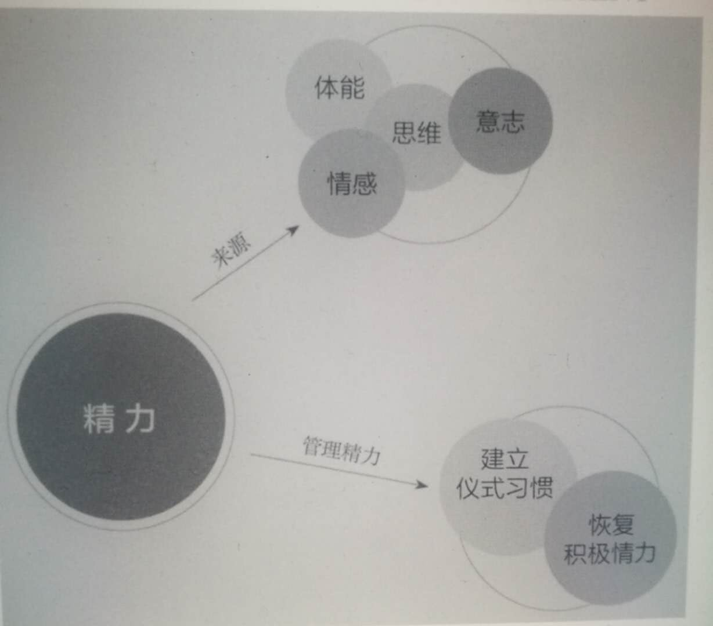
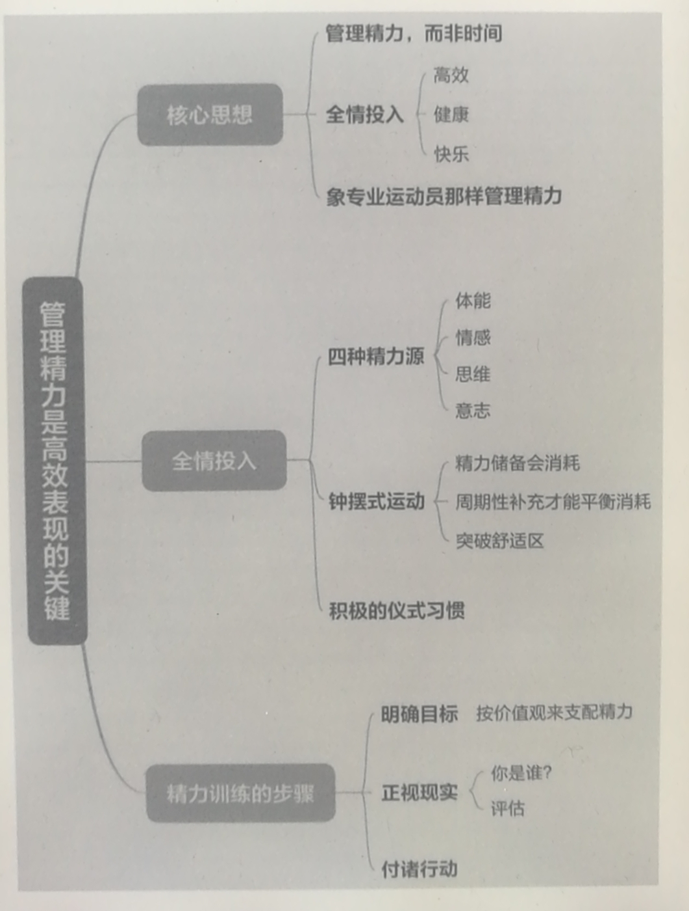
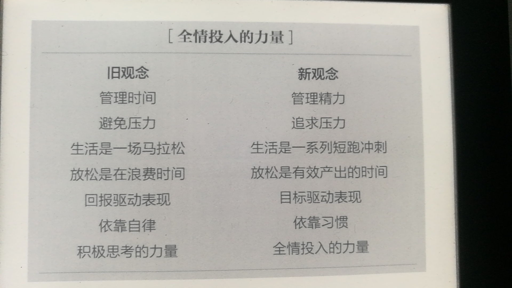
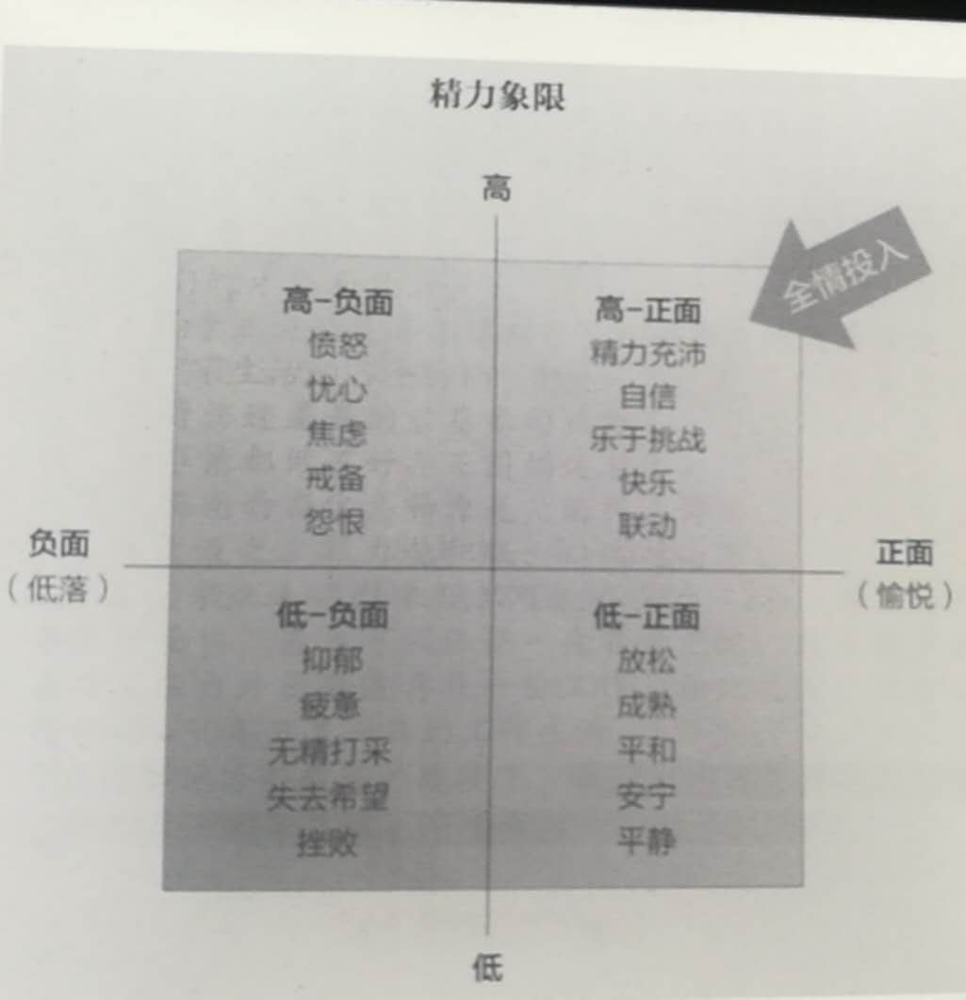
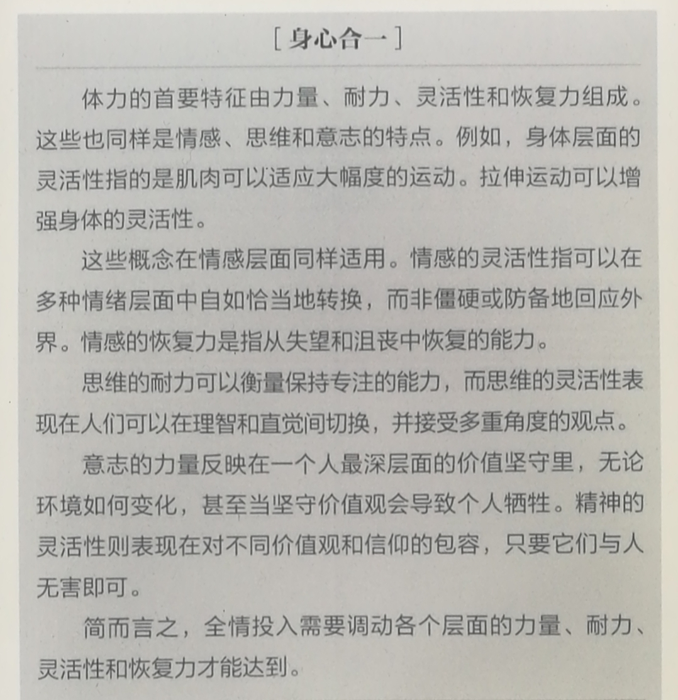
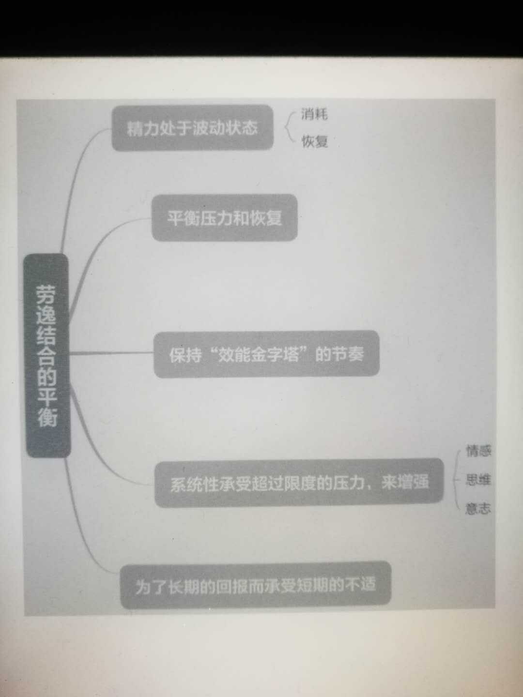

精力管理
===

> 管理精力，而非时间:互联网+时代顺势腾飞的关键

【美】 (吉姆·洛尔 (jim Loehr);托尼·施瓦茨, tony Schwartz)


# 第一部分 如何做到全情投入

<div align="center">  </div><br>

## 第一章 什么是精力及如何管理精力

精力就是做事情的能力。包括**体能、情感、思维、意志**四个方面。

<div align="center">  </div><br>


数字时代下人们的生活状态如下:

> 我们对广度的热爱超过了对深度的关注，注重反应速度却不愿深入思考。我们流连于事物的表象，满足浅尝辄止的片刻欢愉，却几乎从不久留。我们在人生的道路上争先恐后，却吝于用片刻思考目标或方向。我们事务缠身，却又总是筋疲力尽。

### 全新的理论:

* 精力，而非时间， 是高效表现的基础。

	> 我们所有的想法、情感和行为都对精力有积极或消极的影响。生命的终极质量并非由寿命衡量，而是由我们如何在拥有的时间里投资精力决定。

* 有技巧的精力管理是高度表现、健康和幸福的基础。

	> 全情投入需要身体活跃、情感联动、思维集中，并且达到超出个人短期利益的意志高度。


<div align="center">  </div><br>

## 精力管理的四个基本原则

人们通常认为，才华横溢的人面对挑战时只要配备足够技能，就能够发挥出最好的水平。从我们的经验来看却并非如此。精力才是完全点燃才华和技能的正解。

#### 我们如何才能保持最佳表现，同时又不损害健康、幸福和对生活的热情呢？ 

> 你一定要全情投入。优秀表现的难度在于，它需要从各个方面更有效地管理精力，达到最终目标。

### 原则一： 全情投入需要调动四种独立且相关联的精力源： 体能，情感，思维和意

<div align="center">  </div><br>

### 原则二： 因为使用过度和使用不足都会削弱精力， 必须不时更新精力以平衡消耗

事实上，不断增长的需求逐步耗尽了我们的精力储备 ——--尤其由于我们不对随着年龄出现的能力减退做任何补救。通过全方位的训练，我们可以极大地减缓身体和思维的衰退，并切实地深化情感和精神的能力，直至生命的尽头。

<div align="center">  </div><br>

要想保持生命的跃动， 我们必须学习如何有节奏地 消耗和更新精力

> 最丰富、最快乐和最高产的生命的共通之处，是全情应对眼前的挑战，同时能够间断地放松，留给精力再生的空间。

这就好像是短跑运动而不是马拉松，我们需要学会将自己的生活看作**一系列短跑冲刺**，在某些时间段全情投入，在另外一些时间段闲云野鹤，更新精力储备，以应对下一个挑战。

### 原则三： 为了提高能力，我们必须突破自己的惯常极限， 模仿运动员进行系统训练

我们锻炼情感、思维和意志能力， 采用的是与锻炼体能相同的方法。

> 通过突破极限和休整恢复，我们可以在各个方面获得成长。

肌肉锻炼的最大障碍是，大多数人在刚刚体验到超出极限的不适时就退缩了。为了满足生活对我们的索求，我们必须学会在能力不足时系统地训练、增强肌肉力量。

### 原则四： 积极的精力仪式习惯，即细致具体的精力管理方法， 是全情投入、保持高效表现的诀窍。

**变革的难点**在于，有意做出的改变常常无法坚持下去，我们的意愿和自律性远比我们想象的薄弱。

「“仪式习惯”」指的是定义明确、具有高度计划性的行为。毅力和自律将人们推向某种特定的行为方式，而仪式习惯自动会把人们拉向某条轨道。

> @yx 想象一下你在军训时的情形，在教官的监督下，你可能挺直腰杆(毅力)向前看，要是换做平时，你可能早已“葛优躺”(仪式习惯)啦。

我们发现，为了确保全情投入，建立良好的仪式习惯是精力管理的最有效方式。

> @yx 所以说，养成一个好的习惯是远比依靠意志力更好的方式，后者发挥可不稳定，前者就好像“地球重力”一般将你拉回地面。

## 管理精力的三个步骤

我们发现，三个步骤：即**目标-事实-行动**，保证了变革的持久性，三者缺一不可.

### 变革过程的第一步是明确目标。

面对自己的固有习惯，以及维持现状的天性，我们需要受到启发，做出改变。

> @yx 俗话说，“江山易改本性难移”，维持现状也是人类在基因深处决定的，你想啊，要是在远古时代一个好的求生习惯随意就变了，人就被野兽吃掉了。
> 
> 具体还可以参见《穷查理宝典》，看看为什么人更愿意维持现状的深层原因。

多数人花费太多时间处理眼下的危机，应付他人的期望，而不是思维清醒地思考什么最重要，并以此为指导做出谨慎的选择。

因此，在明确目标的阶段，作为计划变革的我们，重要的任务是梳理人生中最重要的事情，并在人生和工作方面构建切合实际的愿景。

### 制定变革的计划离不开对个人现状的清醒认知。变革的第二阶段就是面对现实。

逃避沉重而不愉快的真相是人的天性。

> @yx 特别是这个“娱乐至上”的时代，追求短暂刺激的快乐相比于沉重不愉快的改变，看上去实在“好多了”，要是有人问你是要吃个高热量的慕斯蛋糕还是选择跳出舒适圈去跑步 5 公里，我想大多数人应该分分钟就会给出答案。

### 变革的第三步是行动。

用实际行动缩小“现实的我”与“理想的我”、 “目前的精力管理方式”与“为达目标所需要的精力管理方式”之间的差距。在此过程中需要建立以**良好精力仪式习惯**为基础的个人发展计划。

> 创造并维持全方位的精力充沛是可行的，我们并非只能被动等待精力随着时间衰退下去。养成精力仪式习惯需要在具体时间发起明确的行动，由深层价值观驱动。

亚里士多德所说，“我们每一个人都是由自己一再重复的行为所铸造的。

> @yx 简而言之，今天你的状态/处境是昨天选择的结果。比如，昨晚你选择了通宵熬夜，今天你感觉整个人“被掏空”，提不起精神。


## 本章要点

* 精力管理，而非时间，才是高效表现的基础。高效表现源于有技巧的精力管理。 

* 领导者正是团体精力的统筹人。他们首先要具备个人精力管理技巧，然后才能调动、集中、投入和维持团队的集体精力。 

* 全情投入是确保最优表现的最佳精力状态。 

* 原则一：全情投入需要调动四种独立且相互关联的精力源：体能，情感，思维和意志 

* 原则二：因为使用过度和使用不足都会削弱精力，必须不时更新精力以平衡消耗 

* 原则三：为了提高能力，我们必须突破自己的惯常极限，模仿运动员进行系统训练。 

* 原则四：积极的精力仪式习惯，即细致具体的精力管理方法，是全情投入、保持高效表现的诀窍。 

* 确保改变持久需要完成三个步骤：明确目标，正视现实，付诸行动。

## 第二章 成功人士罗杰遇到的5个障碍

体能不足是罪魁祸首。

> 精力断层会强烈影响他的急躁程度和专注时间。
 
> @yx 比方说一个常见的情景: 你每天工作下午4，5点时的状态相对比较糟糕，又饿又困，很难以饱满的精力处理工作,这其实就是精力断层(比如饥饿)带来的影响。

**运动**可以抵消暴饮暴食的部分后果，还能有效缓解负面情感，让思维恢复清醒。

罗杰由于一系列原因导致急躁和消极，从而情感账户告急。精力低下显然是根源之一，它让罗杰难以抵抗消极情绪的侵袭。

> 精力具有极强的传染力，负面情感开始滋生蔓长，领导者对其他人的精力影响尤其明显。

> @yx 这给我们启发，无论是在工作还是生活中，我们需要积极调节自己的精力，从而掌控自己的情绪。一个常见的情形: 在公司忙碌了一天，精力不济，无心管家庭事务，更缺乏耐心甚至出现情绪急躁，出现家庭冲突。

精力的强大源头在于**目标清晰**。

> @yx 你可能在生活中见过一些“超人”，比如充满激情的创业者，每天其实非常忙碌甚至睡眠也缺乏，但是看上去却精力过人，除了一部分人天赋之外(比如基因)，一个清晰的目标也是一个非常重要的因素。

## 第三章 高效表现有节奏——劳逸结合的平衡

> @yx 这样的场景想必在生活中不少见:
> 
> 长时间工作，极少休息，即便在家里他也不停消耗自己的思想精力 (比如刷手机、刷电视综艺等等)，从来不给自己恢复的时间。疲倦带会来焦虑、易怒和自我怀疑。

人需要顺应消耗与恢复的节奏，运动与休息的交替进行可以最大限度提高表现。**“张弛有度”**是全情投入、维持机能和保持健康的关键。

> @yx 这就好像一根橡皮筋，如果你一直让它处在紧绷的状态，哪一天即使想让它恢复正常长度也是没法做到了，时间久了更容易“崩断”。

<div align="center">  </div><br>

如今，**「“训练-休息”」的比例搭配**仍是建立**训练周期**的基础理论，被全球的顶尖运动员广泛采用。

> 通过一定时间的活动消耗，人体需要从基础生化源获取能量。这一过程叫作“补偿”，消耗的能量通过补偿而得以恢复。

精力简单来讲就是做事的能力。

### 人类最基本的需求是精力的`消耗与恢复`。

过度消耗而恢复不足最终将导致精力衰竭崩溃，恢复超出消耗则导致萎缩和衰弱。

持续健身能带来身心改善，但若停止一周，曾经的改善就会大幅退步，只要停止4周，这种改善就会完全消失。

情感的深度和适应力取决于`外界交往的积极程度`和`内省`习惯。

> @yx 你的深度越大，最大存量的上限也越高，对抗精力消耗也就越有优势。如果你是沙漠里的一条小溪，没有外部补充很快就会干涸；如果你是大海，即使没有外源汇入，你也可以支撑很久(虽然可能成为一片“死海”吧)。

全情投入需要在各个层面培养精力消耗（压力）和精力再生（恢复）的动态平衡。 

### 我们称之为`有节奏的波动`，它代表了生命的本质脉动。

波动越强，我们越能够做到全情投入。

> 鼓励人们适度休息的企业文化不仅能够提高员工的忠诚度，也会给组织带来更高的效率。
> 
> @yx 所以，一味地“996”短期来看给企业带来了经济利益，但从长远来看，不仅损害了员工的忠诚度(如健康导致)，而且也难以维持一个长久的“高”效率，大家士气疲惫，毕竟人是一家企业核心的财富。

## 遵循生命的节奏

自然本身存在**规律的脉动**，在活跃和休息之间有节奏、波浪形地交替。

> 比如涨潮退潮，四季更替，日升日落，不胜枚举。

### 我们是波动世界内的波动个体。节奏性存在我们的基因中。

研究表明，大脑清醒状态下也存在同样的 90～120 分钟的周期，即次昼夜节律。

```
多数人克服自然循环的方法就是勉力斗争，让身体释放压力荷尔蒙，使自己能够应对突发事件。 长此以往，毒素会在体内积累。

压力荷尔蒙在体内定期循环，或许能暂时保持机体活力，但时间一长就会出现多动、咄咄逼人、急躁、烦躁、愤怒、自私自利、对他人漠不关心等症状。

因为身体需要张弛有度，我们常常通过人工方式制造波动，缓解生活的单线化，比如精力不足就喝咖啡、浓茶等。
```

## 利用碎片时间见缝插针地休息

利用碎片时间见缝插针地休息 学习短跑运动员，就是把生活拆分。

通过建立高效的体力恢复机制，专业运动员能够在极短的时间内完成精力再造。

得分间隙休息的影响是惊人的，在高压比赛下甚至能够影响比赛等胜负，比如温网比赛中的短暂休整就有可能完成“逆转”。

> @yx 恢复周期对创造力和亲密关系都同等重要。声音通过音符间的停顿空白组成了音乐，如同字母和空白组成了单词。你想想，要是一个音乐没有间隙(恢复时间)，唱个不停，对于歌手的“肺活量”是什么样的挑战，这首音乐也会失去平衡，“难以入耳”。

## 工作中如何休息

### 如何避免高强度压力下工作的过度劳累？

几乎所有人都提到了**定期更新精力**的方法。

- 故事1: 发明了交互式电视的温克传播公司董事长维尔德罗特发明了一套自称为`“猎狮”的活动`。“我‘潜伏’在办公室里，问大家手头上都在忙些什么，与平日不太交流的员工增进感情。‘猎狮’能让我放松下来，哪怕仅仅30分钟，也能让我从迫在眉睫的日程中短暂离开。

- 故事2: “我从来不在飞机上工作，不碰手机，不碰电脑，不办公，只是阅读书籍报刊，听听音乐，做那些我通常没有时间做的事。要想工作总有理由，因为事情来得总比你的处理速度快。但如果不腾出时间休息，你就会失去效率。

- 故事3: 我认为工作之余**做一些自己喜欢的事**也非常重要。我喜欢外出采风，走进自然，自然让我重新振作，变得更加专注。摄影练习需要不断调动大脑的创造力，有时工作都未必有相应的效果。它能培养直觉思维，在工作决策时会特别有帮助。

## 团队如何休息

- 故事1: 咨询结束几周后，他就完全改变了以往的开会方式，雷打不动地每90分钟组织15分钟的休息，并要求大家在休息期间不要谈论工作。

## 这世界憎恶休息

在之前的罗杰的故事中，用运动术语来讲，罗杰在思维和情感上过度训练，却在体能和意志上训练不足。

从最实用的角度看，全情投入的能力取决于**周期性休息的能力**。对多数人来说，要做到全情投入，我们需要从新的角度思考如何管理精力。

<div align="center">  </div><br>

- 故事1：我已经开始有意地避免开会，只是为了控制不断增长的邮件数目。

由于我们习惯于反天性而为，无视自然赋予的节奏，因而有意地划出工作和休息的界限更为重要。**我们必须学会为一天画上休止符，强迫自己在固定的时间离开跑道，停止处理信息，把目标从工作成果转向精力恢复**。

我们越是忙碌，越会高看自己，认为自己对他人来说不可或缺。我们无法陪伴亲人朋友，不知疲倦，没日没夜，只管四处救火，不给自己留下喘息的时间。这就是现代社会的“成功典型”。

## 压力成瘾

狂热不停歇的工作节奏实际上有可能令人上瘾。压力荷尔蒙如肾上腺素、去甲肾上腺素和皮质醇会让人亢奋，创造出一种带有诱惑的冲动，也就是人们所说的「**肾上腺素迷幻**」。

工作狂是一种**强迫症**，通过自我强加的要求，无法约束工作习惯，放纵自己沉迷工作，忽视一切工作以外的事情。

## 过劳致死

高强度的精力消耗并非是过度疲劳、效能打折和体力崩溃的直接原因，**持续消耗加恢复不足**才导致了这样的后果。

研究者发现过劳死亡的5个明显诱因： 

* 妨碍正常恢复和休息模式的超长时间工作 

* 妨碍正常恢复和休息模式的夜班工作 

* 无假期无休息的工作 

* 高压无休息的工作 

* 高强度体能消耗和持续高压的工作

这五种诱因的共同点在于**长期的精力消耗模式和缺乏间歇休息**。

许多证据表明，高度单线化的生活方式，包括暴饮暴食、睡眠缺失、心焦气躁、缺少锻炼、长期压力过大等都有高致病风险，甚至可能导致过早死亡。

## 精力超支怎么办

为了提升能力，我们需要**系统性地增大压力，随后得到充分休息**。提升肌肉极限，就要说到“超量补偿”的概念。若现有的肌肉力量不足以达到要求，身体就会通过制造更多肌肉纤维来应对下一次刺激。

### 通过超极限消耗精力并有效恢复， 我们会在各方面成长

> @yx 不仅仅是体力能力可以通过这种方式成长，脑力能力也是可以通过这种方式成长，比如高强度地用脑过后，有效充分恢复，脑力上限将变得更高。

### 拓展能力需要为了长期回报接受短期不适

最佳时刻，往往发生在一个人的身心为了达成艰难目标或者完成有意义的事情，而自愿达到极限的时候，其实这就是一种“心流”。

一旦燃料不足，我们往往选择贮存现有的精力，利用有限的资源保护自己，这种现象就是**「防卫支出」**。因此，如果想获得持续成长而非固步自封，准确评估生活的威胁等级就尤为重要。

## 超出极限与定期休整的平衡

**`复健`**是我们系统性地恢复能力的过程。复健的方式大同小异：**让受伤的部分承受从轻到重的压力**。

重塑能力需要把自己再一次置于曾经受伤的环境。只要恢复得充足，我们的极限都会达到新的高度。

> @yx 比如骨折后的手臂的恢复，锻炼后撕裂的肌肉。

> 当我们面临挑战而不是威胁时，也会愿意主动拓展自我，即使意味着需要冒风险或接受不适。

**能力拓展的关键在于，既要超出日常的极限，又要定期休整恢复，二者兼备才能成长**。

## 本章要点 

* 精力的消耗与恢复是人类最基本的需求。我们称其为波动。 

* 波动的反面是直线：精力消耗大于恢复，或者精力恢复大于消耗。 

* 压力与恢复的平衡对于个人或团体的高效表现都至关重要。 

* 我们必须在四个层面都保持健康波动的节奏，即“效能金字塔”的组成部分：体能，情感，思维和意志。 

* 我们培养情感、思维和意志能力的方法与体力相同，必须系统性地将自己置于超出惯常极限的压力当中，并在过后得到充分恢复。

* 拓展能力需要为了长期回报接受短期的不适。