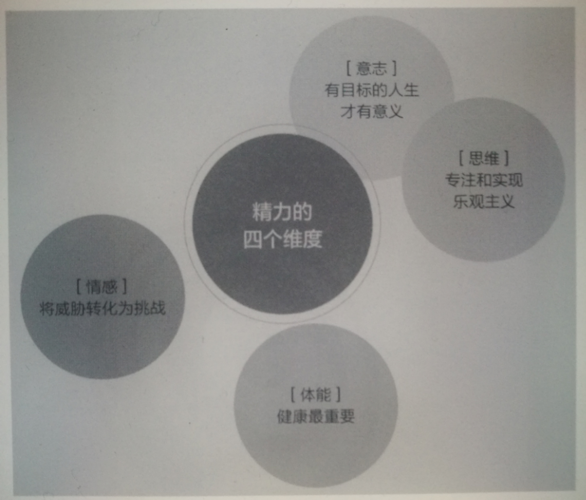
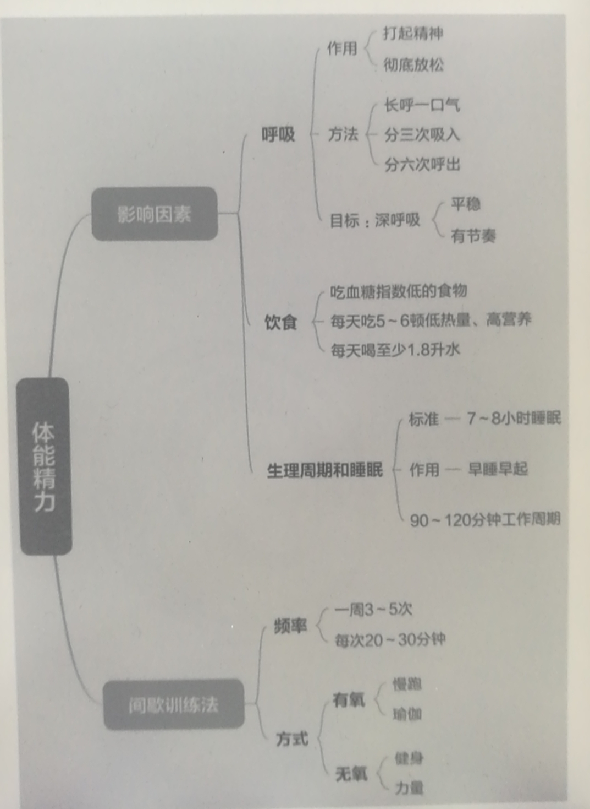
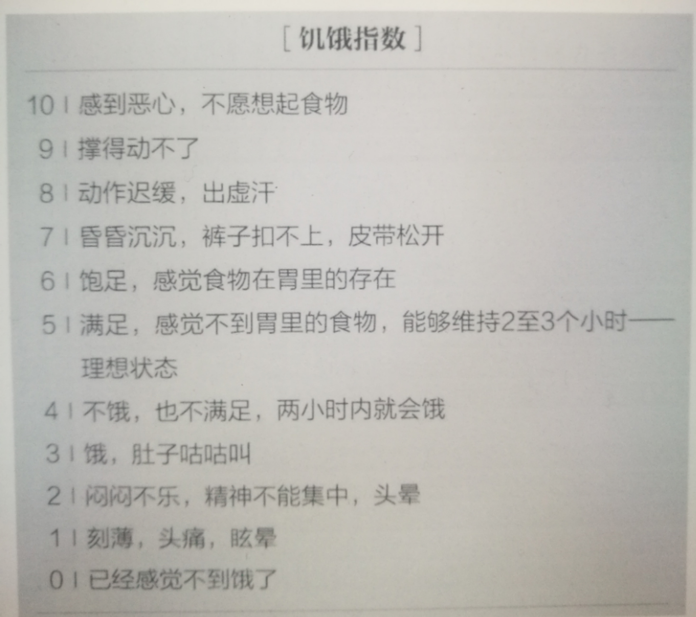
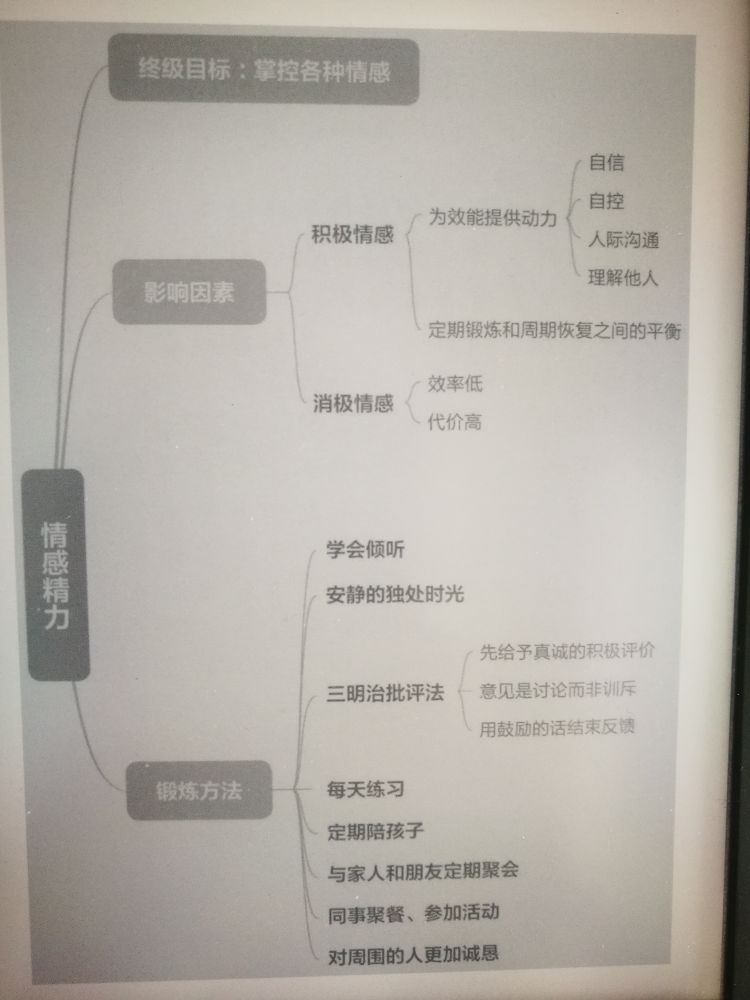
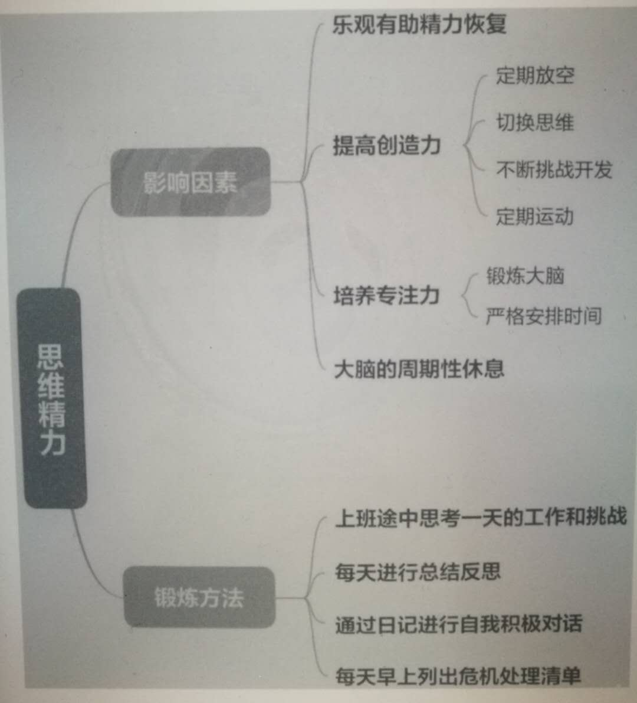
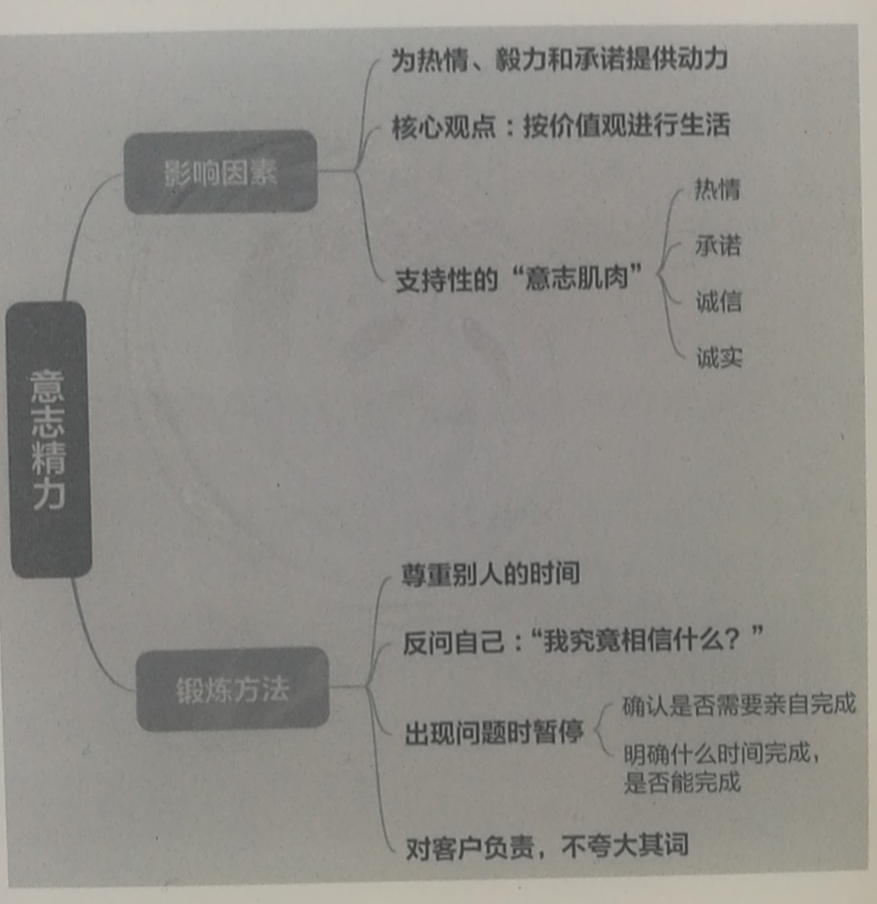

# 第二部分 精力的四个来源

  
 

## 第四章 体能精力——为身体添柴加火

体能不仅是敏锐度和生命力的核心，还影响着我们管理情绪、保持专注、创新思考甚至投入工作的能力。

  
 

**体能是燃料的基本来源**，即使大部分工作时间都是坐着一动不动。它不仅是敏锐度和生命力的核心，还影响着我们管理情绪、保持专注、创新思考甚至投入工作的能力。

* 从生理学的角度看，精力来源于氧气和血糖的化学反应。

* 从实际生活来看，精力储备取决于我们的呼吸模式、进食的内容和时间、睡眠的长短和质量、白天间歇恢复的程度以及身体的健康程度。建立起体能消耗和恢复的节奏性平衡，能够确保精力储备保持在相对稳定的水平。

### 生命中最重要的节奏常常被我们视为理所当然，尤其是**呼吸和进食**。

呼吸是自律的有力工具，既能集聚精力，又能带来深度放松。延长呼气时间有利于精力恢复。

**三次一组吸气、六次一组呼气可以使体能、思维和情感平复下来**。深度、平静、有节奏地呼吸会激发精力、敏锐和专注，也能带来放松、宁静和安宁。这就是健康的终极脉动。

## 调整饮食方式

* **长期过度进食**则是过度“恢复”的典型代表，导致身体肥胖，损害精力。

	> 高糖高脂的食物和简单碳水化合物可以产生精力，但它们与**`低脂蛋白和蔬菜谷物`**等复合碳水化合物相比，不仅转化效率低，释放的能量也不如后者丰富。
	
	> @yx 这也是为什么，我们应该减少碳水化合物的摄入，而增加低脂蛋白和蔬菜谷物摄入。

* **选择升糖指数低的食物同样重要**。升糖指数用以测量糖分从食物进入血液的速度（详见《实用资料》中食品升糖指数举例）。缓慢释放的糖分能够提供更稳定的精力。

	> - 一顿低升糖指数的早餐可以提供高效并持久的精力，例如全麦食物、蛋白质和低糖水果——草莓、梨子和苹果等。
	> - 相反，高升糖指数的食物如松饼和甜麦片短期内可以激发精力，但30分钟后精力水平就会显著下降。

* **一天内吃五至六餐低热量而高营养的食物能够供应稳定的精力**，因为即使精力最丰富的食物也不足以支持4～8小时的高效表现，但这是我们许多人的两餐间隔时间。

* 想要维持良好表现，不仅要**定期进食**，还要每次摄入足以维持两至三个小时精力的食物。**控制进食量**在管理体重和管理精力两方面都很关键。

	> 多吃多餐跟少吃少餐一样有问题。两餐之间的零食热量应该控制在100至150卡路里之间，并选择低升糖指数的食物，例如坚果、葵花籽、水果或半条200卡的能量棒。 

为将体能最大化，我们必须让自己**更加熟悉进食适当的程度——不感到饥饿也不感到撑胀**。大多数人总是陷入两个极端（详见下方的饥饿指数），花了太长时间消化食物，又一次吃太多补回来。因为精力需求到夜晚会减少，新陈代谢也会减缓，因而早上多摄入热量、晚上少摄入热量是有科学道理的。

> @yx 俗话说"早上吃好，中午吃饱，晚上吃少"。

  
 

我们还发现，**喝水或许是最常被人忽略的体能再生方式**。口渴不会像饥饿一样散发出明显的信号，等我们感到口渴的时候，身体或许已经缺水很久了。一家研究机构称，**每天至少饮用 1.8 公斤水对维持体能有诸多好**处。肌肉若缺水3%就会失去10%的力量和8%的速度。喝水不足也会损害大脑的注意力和协调能力。 

**多喝水**还有助于健康和长寿。

> 澳大利亚的研究员在一项2万人的调查中发现，每天喝5杯230毫升水的人比喝2杯以下的人死于冠心病的几率更小。

[参考示例]

	仪式习惯
	7:00 早餐：全麦麦片或蛋白粉饮料 
	10:00 点心：半条低糖能量棒，或一把坚果，一块水果 
	12:30 午餐：熟食店的沙拉 
	15:30 点心：同10:00点心 
	19:00 晚餐 
	20:30 甜点（酸奶冰淇淋等）

> 一次性解决步骤 
> 
> - 在购物清单中加入能量棒、水果、葵花籽、全麦麦片、原味酸奶、蛋白粉和瓶装水。 
> - 清除家里的曲奇、薯片、脆饼及其他垃圾食品。 
> - 星期天晚上将一周的点心放进公文包里。

我们都赞同“80/20”的原则：如果你摄入的80%的食物都是健康而高效的，剩下的20%可以是你喜欢的任何食物，只要份量控制得当。

## 调整生理周期与睡眠

即便少量的睡眠缺失——我们称为「精力再生不足」—---—也会深刻影响力量、心血管能力、情绪和整体精力水平。大约有50项研究表明，思维能力——即反应时间、专注力、记忆力、逻辑分析及辩证能力——会随着睡眠不足而衰退。睡眠需求随年龄、性别、基因体能而异。

精力再生不足或再生过量都会增加死亡的风险。

	@yx
	所以，我们要尽量避免熬夜。

夜晚工作的时间越长、越连续、结束得越晚， 你会变得越低效，也更容易犯错误。

「小憩」就是一种精力恢复手段。斯坦皮发现，小睡片刻的工人即便不能长时间睡眠，仍可以保持超过24小时的惊人高效和敏锐。**唯一需要注意的地方就是小憩需要定时，以免受试者陷入更深的睡眠中**。

> 如果小憩超出30或40分钟，许多受试者会感到眩晕无力，甚至比不睡更加疲倦。

## 调整每天的工作节奏

精力的波动与次昼夜节律息息相关，**生理信号以90～120分钟为周期**。不幸的是，大多数人都习惯于无视自然的节奏，直到大脑再也无法理解那些信号的含义。

一旦缺少主观干预，精力储备会在一天内数次降低，下午3点或4点是次昼夜和昼夜节律的最低点。

你必须在午餐和晚餐之间抽空睡一会儿，别无他法。脱下衣服躺在床上，这就是我的习惯。不要认为自己在白天睡一会儿就会耽误工作，这是毫无想象力的人才有的愚蠢想法。

	@yx
	这就是为什么午睡之后精力会更加旺盛，不要为了“节省”午睡一点时间而因小失大。

## 间歇性训练的价值

提升力量与耐力需要我们踏出舒适区，体验不适的感觉，并且需要持续一定时间才能见效。

**人们普遍推崇的健身方式是20～30分钟的连续锻炼，每周进行3到5次，锻炼期间心率达到最大值的60%到85%**。

> 一项联合研究发现一系列短时间、高强度的有氧练习 ——- 维持60秒左右——加上完整的有氧恢复过程，对于受试者有出人意料的积极影响。只需8周时间，受试者的心脑血管健康水平显著提升，心率变化减少，情绪得以改善，免疫力提高，舒张压也降低不少。

间断性训练长久以来都是我们训练系统的核心组成部分。参与方式有很多，包括短跑、爬楼梯、骑自行车甚至举重，只要能够节奏性地提高和降低心率即可。

#### 间歇训练可以增大精力的容量，使身体可以承担更多压力，并且更加高效地恢复。

## 增加力量训练提高精力

力量训练与心血管训练同等重要，体力丧失是机体衰老和能力下降的显著特征。过了40岁，如果没有日常的力量训练，人们平均每年失去1/2磅的肌肉重量。

从更广的层面来讲，力量训练也已经证实可以全面增强精力、加速新陈代谢并强健心脏。

研究表明，**肌肉损失是导致老龄化虚弱的最主要原因**。骨质密度下降会增大骨质疏松的风险，让骨头变得更加脆弱，

减少或避免压力与承担过度压力具有同等的损害效果。

> 比如长期卧床修养会给患者造成更大损伤。

## 你要记住这些要点 

* 体能精力是生活最基本的精力源。

* 体能精力通过氧气和葡萄糖的化学作用获得。 

* 体能精力最关键的两项调节器是呼吸和进食。 

* 每天吃5～6顿低热量高营养的食物，能够为机体持续供应葡萄糖和必须的营养。 

* 每天喝64盎司的水是有效管理体力的关键要素。 

* 大多数人需要每晚7～8小时的睡眠，方可正常运作。 

* 早睡早起可以优化效能表现。 

* 间歇训练比稳态训练在锻炼体力方面更有效，在体力恢复方面更高效。 

* 为了保持全情投入的状态，我们必须工作90～120分钟就休息片刻。

第五章 情感精力——把威胁转化为挑战
====

  
 

在生活中，自信、自控、社交技巧及共情能够牵动积极情感的“肌肉”。通俗来说，就是耐心、开放、信任和喜悦。

从精力角度来看，**负面情感代价昂贵且效率低下**。它们会快速耗尽我们的精力储备。

#### 保持正面沟通是有效管理的核心。

## 如何获得正面情感

> 请思考一下你的生活。每周你会拿出几个小时仅仅做一些有趣放松的事情吗？有多少时间你感到自己彻底的放松？你上一次摒弃杂念、完全投入某件事情是什么时候？

所有能带来享受、满足和安全感的活动都能够激发正面情感。由于人们兴趣各异，这些活动可能是唱歌，园艺，跳舞，亲热，练瑜伽，读书，体育运动，参观博物馆，听音乐会，或者仅仅是在忙碌地社交之后静坐自省。我们发现，**关键是要表达出你对这些活动的重视，并将投入在它们上面的时间视为神圣而不可侵犯**。

从科学角度看，看电视对思维和情感的影响等同于垃圾食品对身体的影响。看电视或许可以带来暂时的恢复，却缺乏营养，容易使人消耗过度。相比之下，情绪恢复的来源越丰富、越有内涵，我们越能补充自己的精力储备。

## 学会从跌倒处站起

有时我们会不由自主地经历情感风暴，接受人生汹涌而来的挑战。让自己被风暴淹没还是在风暴中成长，取决于我们的情感管理方式。

## 让人际关系促使精力再生

保持优秀表现的诀窍之一是**在工作环境中至少交一位好朋友**。一段稳固的关系包括付出与回报、倾诉与倾听、珍视他人和被人同等珍视。如果一段关系中总是付出而得不到相应的回馈，不免会感到空虚和失落。以自我为中心的关系，也称不上真正的情感关。

> 比如在健身过程中建立的新友谊。有氧课程提供了人际交往的平台，她开始跟其他同好频繁聚餐。

	杰德的解决方案 
	目标肌肉：亲密度 
	表现障碍：情感关系缺乏深度 
	期望成果：与他人深层交流
	
	仪式习惯 
	周一晚上：和女儿吃晚餐 
	每隔一周的周三晚上：与妻子约会 
	周六8:00-9:30：与妻子安静交谈 
	周五13:00-14:00：与下属共进午餐

> 至于办公室的情况，杰德决定每周五与一位下属共进午餐。下属们起初非常不安，因为上司从未给予他们如此的关注。但他们慢慢发现，上司好像也没有其他意图。杰德与下属的关系越来越紧密，还有人直接当面感谢他花时间与他们相处。几个月后，杰德又发起一项新计划。每月一次，他会邀请同事下班后参加集体活动——打保龄球、聚餐或者滑冰，让大家在私人时间里聚会。

## 积极扩充情感容量

锻炼情感肌肉等同于锻炼身体肌肉，也需要迈出当前的舒适区，并随后进行休整，恢复精力。

	阿伦的解决方案
	目标肌肉：共情 
	表现障碍：糟糕的倾听技巧，缺乏共情 
	期望成果：有深度的人际关系 
	
	仪式习惯 下午2:00：与一位员工聊天，从倾听而非讲话开始。用我自己的话向讲话人反馈，转述我认为自己听到的内容。使用类似“我认为我明白你的意思”的表达方式。

	
	保罗的解决方案 
	目标肌肉：耐心 
	表现障碍：急躁，过于挑剔 
	期望成果：更积极的人际关系 
	
	仪式习惯 
	面对压力时念出“心平气和”的咒语 
	腹式深呼吸，放松肌肉 
	将威胁变为机遇
	用三明治技巧给出反馈 
	为自己的行为负责 
	一次性解决步骤 
	将锻炼从早晨5点移到午间

> 如果保罗认为有必要提出批评的意见，他会采用 “三明治”技巧。首先真诚地对该员工的良好表现给出正面评价，然后以讨论而非宣讲的形式提出批评意见——因为自己的看法或许并非完全准确，最后以鼓励结尾。

## 学会接纳不同的情感

**情感容量的最高境界，是足以驾驭所有情感的能力**。因为我们的思维很难处理相反的冲动，我们倾向于选择向上的一面，重视某些情绪技巧，忽视甚至看轻另外一些。

请留心你对那些对立品质的评价和态度。只有**接受那些看似相反的品质，不逼自己在其间二选一，**才有可能获得最深刻最丰富的情感能力。情感层面的全情投入需要遵循斯多葛派哲学家的“破格文体”——美德的共同存在性。

## 你要记住这些要点 

* 为了达到最佳表现，我们必须汲取愉悦、积极的情感，享受挑战、冒险和机遇。 

* 正面情感精力的关键因素是自信、自控、人际关系与共情。

* 负面情感也可以维持我们的生活，但相比于正面情绪代价巨大，事倍功半。 

* 在高强度压力下调动积极情感的能力是领导力的核心。 

* 利用情感肌肉支配表现，需要依靠定期锻炼和间歇恢复的平衡。 

* 任何带来享受、令人满足和安心的活动都可以作为情感的再生和恢复方式。

*  练习耐心、共情、自信等情感肌肉的方法与锻炼二头肌或三头肌的方法相同：越过当前的极限，留出充足的恢复空间。

第六章 思维精力——保持专注和乐观
===

  
 

优化思维精力的关键因素包括思维准备、构建愿景、积极的自我暗示、高效的时间管理和创造力。

保持专注与乐观的秘诀在于**间歇地变换思维频道，达到精力休息和再生的效果**。如果缺乏思维肌肉来做到最好——注意力涣散、过于悲观、思维固化、眼光狭窄等，则需要通过系统训练重塑这种能力。

当然，正向思维并不总是能够带来期待的结果。消极思维也可以帮我们留意到被忽视的重要需求——不论是食物、休息、情感支持或者眼前的危险。此时，我们接到信号并尽快做出反应，它们也可以变得很有益处。准确评估情况、避免消极或破坏性后果同样重要。

## 在放松中思考

思考会耗费巨大的精力。只占体重的2%大脑需要人体25%的氧气供给。如果思维得不到足够的恢复，会判断失误、创造力减弱、或无法合理评估风险。思维恢复的关键是让正常工作的大脑间歇地休息。

时不时离开工作放松一下是个非常好的习惯……当你回到工作时，做出的判断会更加准确。

## 精力恢复产生创造力

间歇地让右脑主持大局，可以让我们从占据我们多数工作时间的左脑理性分析模式中脱离，得到有效恢复。

#### 「五步论」

许多学者都在尝试定义创造活动的步骤。现在最为广泛接受的是五步论：洞察、汲取、孵育、启示和验证。

五个步骤中，有两个明显需要使用左半脑的逻辑化和分析能力：「汲取」，即依照系统的步骤从众多信息来源中收集有用信息，最后一步——验证，即依靠分析和整理，将创造成果翻译成条理分明、通俗易懂的语言。其他三个步骤——洞察（灵感）、孵育（斟酌）和启示（突破）都与右脑相关，并且经常在我们无意寻找答案或解决方法时发生。

## 重塑大脑

越来越多证据表明，大脑的运作方式也类似肌肉——积极使用能够提升能力，使用不足就会萎缩。

> 研究显示，参与研究的修女需要写一篇文章，描述自己从20多岁到现在的生活，没有比讲述故事和使用复杂语法更能有效地预测阿兹海默症发病风险。

学习新的体育活动会帮助我们打造新的肌肉，锻炼不同的身体部位，学习新的电脑技能、新课程、甚至每天记几个新单词都能帮助我们锻炼思维肌肉，更好地为效能表现服务。

	爱丽丝的解决方案 
	目标肌肉：现实的乐观主义 
	表演障碍：悲观，负面思维 
	期望成果：正面、解决方案为导向的思维 
	
	仪式习惯 7:00：在日记中写出潜在的威胁并将其重新解读为机遇 
	考虑最坏的情况，评估可以接受的后果 
	专注于与生活值得感激的一面

看似紧急的琐事总会盖过那些非常重要却不太急迫的事。这也是许多企业的通病，人们很难在紧迫感面前停下脚步，做出更加深思熟虑的抉择。

## 你要记住这些要点 

* 我们使用思维精力规划生活、集中精力。 

* 最有益于全情投入的思维精力是现实乐观主义——看清事物真相，却仍朝目标积极努力。 

* 优化思维精力的关键在于思想准备、构建想象、积极的自我暗示、高效的时间管理和创造力。 

* 转换思维频道可以激活不同的大脑部分，提升创造力。

* 身体锻炼可以助长认知能力。 

* 思维消耗与恢复的平衡可以帮助思维精力达到最大。 

* 如果缺乏某种思维能力，需要系统地加以锻炼，不断突破自己的舒适区并充分休息。 

* 持续挑战大脑可以有效预防老龄化思维衰退。

第七章 意志精力——活出人生的意义
===

> 尼采有句名言 ：“知晓生命的意义，方能忍耐一切。”

  
 

意志精力是一股掌管所有维度行为的独特力量。它是动机最丰富的源泉，指点方向。这里的意志并非是指宗教概念，而是最简单最基本的定义——**通向最深层的价值取向和超越个人利益的意图**。

意志精力的关键动力在于性格品质——按照价值取向生活的勇气和信念，即使面对艰难困苦和个人牺牲也在所不惜。意志精力的支持部分包括**激情、奉献、正直与诚实**。

有些活动不需太多精力就能大幅获得精力再生，例如在自然中散步，读一本给人启迪的书，听音乐，或者听一场精彩的演讲。反之，精神功课既是精力消耗的过程，也是精力更新的过程。

> 例如。冥想需要调动高度的注意力使思维平静，同时也会带来意志的开阔、内心的沟通，甚至喜悦的情感。

## 知晓生命的意义方能忍耐一切

拓展意志精力需要**将自己的需求置于次位，为超出个人利益的目标让路**。人们往往认为自身需求迫在眉睫，注意力一旦转移，便会引发原始的生存恐惧。

自私自利反而会削弱精力，妨碍表现。我们越是被自己的恐惧和担忧掌控，越难调动精力做出正确举措。

## 重视他人

[真实案例]:

> 我首先会尽力在计划时间内集中精力完成所有议程，如果时间到了会议还没有结束，我会停下来对大家说抱歉，但我不能让别人干等，所以未完成的议题只有下次开会继续讨论。我发现这样做之后，即使是参加会议的人也感觉受到尊重，开会变得更加高效。

对于员工，注意力的重点不要放在安抚上司、担心他们对他的看法上，而是要相信自己的声音、明确表达立场。这并不意味着他要变得激进好斗、与人为敌，而是在尊重他人的同时坚守自己的立场。

	杰里米的解决方案 
	目标肌肉：决心 
	表现障碍：优柔寡断，逃避冲突 
	期望成果：清晰的思维，令人信服的姿态 
	
	仪式习惯 
	为会议做好心理建设：想象自己的意见得到肯定 
	会议之前做好功课 
	问自己“我的真实想法是什么？”
	“我这样说是否为了讨好某个人？”
	
## 你要记住这些要点 

* 意志精力为所有层面的行为提供动力，带来激情、恒心和投入。 

* 意志精力源于价值取向和超出个人利益的目标。 

* 品质——依照价值取向生活的勇气——是意志力量的关键因素。 

* 最强大的意志力量是激情、投入、正直和诚实。 

* 意志精力的消耗与再生密不可分。 

* 意志精力通过超越自身的目标和自我关心间的平衡得以维持。 

* 意志功课会同时消耗和产生精力。 

* 拓展意志力量与拓展体能的原理相同，都要突破我们的舒适区域。 

* 人类的意志精力甚至可以弥补严重不足的体能精力。
