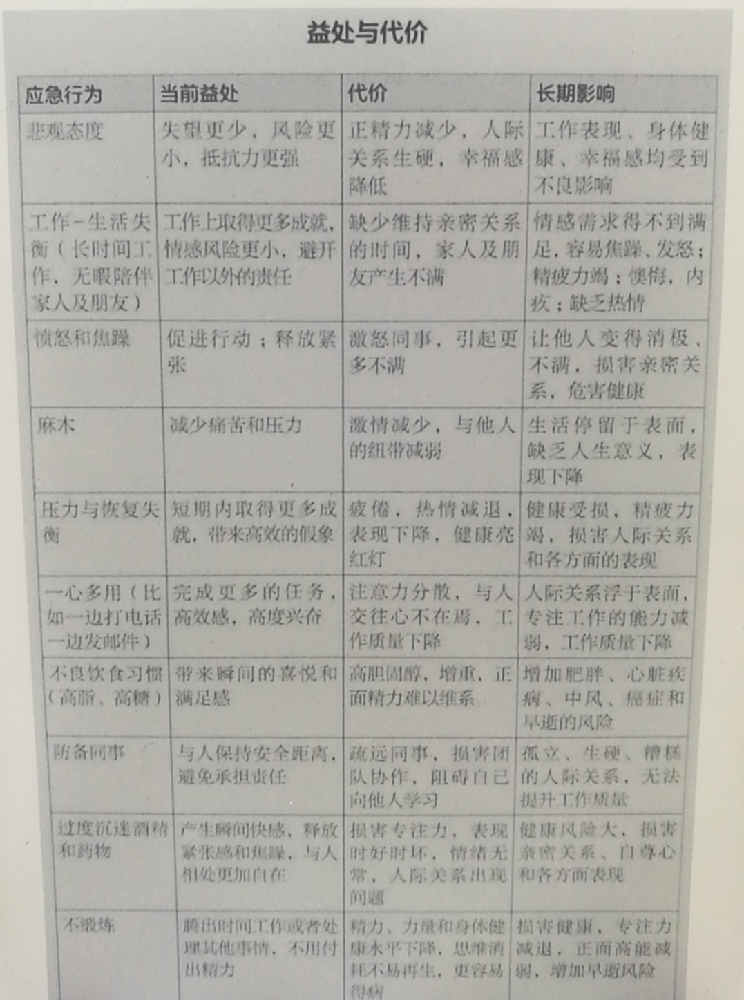
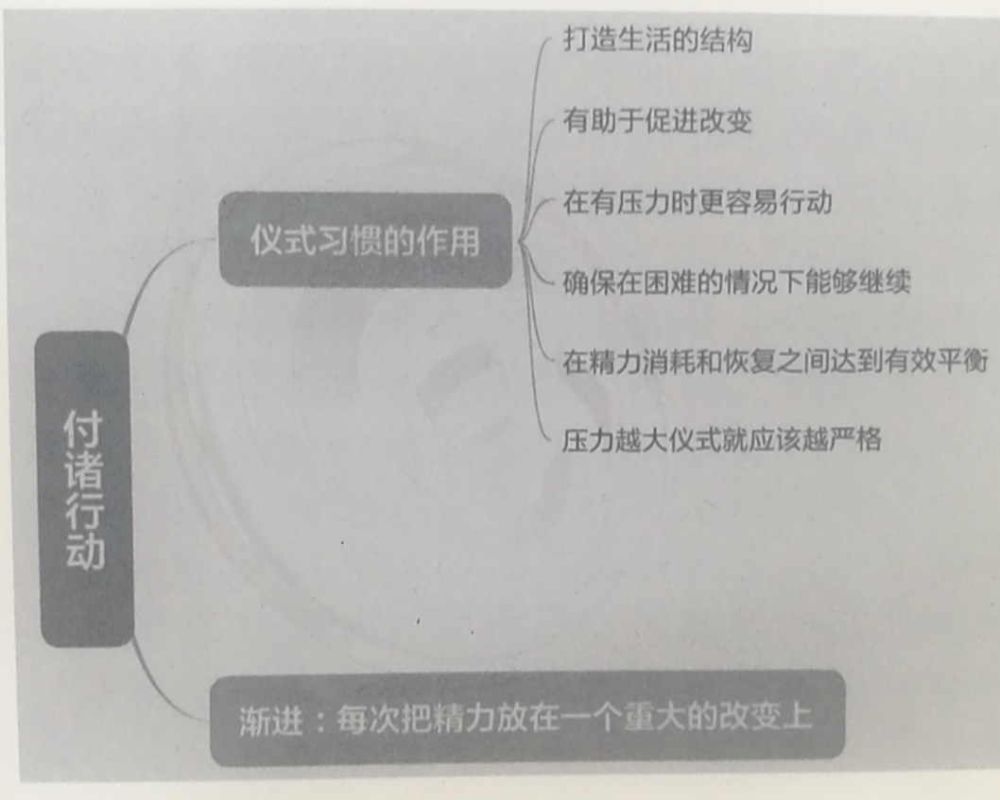

# 第三部分 精力管理训练系统

  
 

第八章 明确目标——知道什么最重要才能全情投入
===

  
 

意志力量是目标最充足的源泉，意志精力来源于深层价值取向和超越个人利益的目标。目标会激发决心。它促成了我们的全情投入，希望将精力集中在某件事或某个目标上。

一旦接受了召唤，我们就踏入了未知的领域，面临怀疑、不确定、恐惧和困境的磨难。有时，我们会意识到自己无法独自完成“英雄之旅”，这时便需要寻求精神导师的帮助。

不幸的是，多数人从未踏上过英雄征途。原因说起来简单却令人难堪：我们太过忙碌，无暇追寻生命的意义。

> 缺乏信仰和坚定的价值观，因而很容易被生活的狂风推来搡去。

## 衡量人生目标的力量

为了快速了解自己的生命意义，请拿出笔和纸回答以下3个问题，分别从1到10进行打分。 

* 每天早晨上班时你的兴奋度是多少？ 

* 享受做事有多大程度是因为事情本身而非它带来的回报？ 

* 你认为自己对价值取向负有多大的责任？ 

> 如果3道问题的总分达到27分以上，说明你已经带着强烈的人生目标生活了。如果总分在22分以下，说明你的生活只是走过场。问题的关键并非在于生活赋予你怎样的意义，而在于你是否主动将生活变成自己价值取向的载体。

我们列举了5条重要品质——恒心、正直、卓越、创新和投入。它们成为他改变的原动力和衡量改变的标准。 “每一天，不管是工作、锻炼还是陪伴家人，我都会问自己正在做的事情是否符合这5条品质。”

## 积极的人生目标

因为缺陷产生的目的也会限制我们的视野。

> 设想一下，如果你坐在一艘行驶在海上的小船里，船底突然开始漏水，你的目的肯定是阻止小船沉下去。但如果你一直忙着舀水，肯定无暇顾及小船的航向。生活也是如此。当我们忙着填补漏洞，不让自己沉底，就没有多余精力探寻更深层的意义了。

犯错并不是世界末日。有时候，与他人交流比观点正确更为重要。

## 内心的目标

没有什么外部激励的限制比金钱的动机限制更加直观。即使金钱是大多数人的首要激励条件，研究者却并未发现收入水平与幸福的直接联系。

外在激励实际上会损害内在激励。

> 人们可以被物质奖励或外部激励所驱使；但是，只有在自由选择并享受事物本身的情况下人们才会表现出更多热情，从中获得更多乐趣。

## 超越个人的目标

> 如果工作的内容是帮助他人、减轻痛苦，让我们变得健康和幸福；或者它能从美感、智力方面丰富内心，改善我们生活的环境。

明确人生目标需要时间，安静、不被干扰的时间，许多人恰巧缺乏这样的条件。我们总是在各种任务之间疲于奔命，找不到方向。花时间思考意义和目标几乎变成一种奢侈和任性。

## 价值观与美德

人生目标扎根于精力，而深层价值取向可以提供精力。这是一种持久的行为模式——实现自我愿景的旅程中遵循的“投入法则”。

为了找到内心最坚定的价值取向，我们建议你留出一段不受干扰的时间，回答以下问题： 

* 如果现在就是人生的尽头，你学到的最重要的3件事是什么？为什么它们如此重要？ 

* 想想你最敬重的一个人，描述他/她身上你最钦佩的3种品质。 

* 你能做到的最好的自己是什么样的？ 你希望你的墓志铭如何总结你的人生？

下面的“深层价值取向清单”列举了一些最普遍的价值取向，仅作参考

#### 体现在行为中的价值观才是美德

合力作用在我们将价值观转换成美德的时候才会出现。只认识到我们的首要价值取向是不够的，接下来需要**细致规划如何将其融入日常生活，并且不惧外界阻力**。

> 譬如：“为了实践慷慨，我会花精力关心他人、不求回报，自愿将我关心的人的事情安排在自己之前，即使有时会给自己带来不便。”

## 价值会影响精力管理的标准

  
 

真正的试炼出现在需要我们抵抗片刻欢愉、付出乃至牺牲的时刻。此时，价值的意义才会真正凸显，它不仅是行为的准则，也是所有精力的来源。

## 言行一致

> 如果她投入精力的目标仅仅是为了取悦老板，结果只会是接二连三的失望。当她将注意力转向内心，挖掘深层价值观，发现自己最看重的是卓越和投入。

## 全情投入的构想

好的构想需要一种谨慎的平衡。

* 一方面，为了激发灵感，它需要有远大的目标，甚至有点超出能力范围

* 另一方面，为了满足可操作性，它需要脚踏实地，细致规划，因人制宜

## 你要记住这些要点 

* 从有记载开始，追寻使命感就是人类文明长河中必不可少的主题。 

* “英雄之旅”需要调动、培养和更新我们最重要的资源——精力，才能协助我们完成最重要的使命。

*  如果缺乏强烈的使命感，我们很容易迷失在生活无常的风暴里。 

*  当使命感从负面变成正面、从外部转向内部、从自我变成他人时，才能为我们提供更强大、更持久的精力。 

*  负面目标源自缺陷，且充满防备性。 

*  内部动机指的是我们对某件事物本身渴望，渴望仅仅源于其带给我们的满足感。 

*  价值观能够提供实现目标的精力。它会带来精力管理标准的变革。 

*  在行动中体现的价值叫作美德。 

*  基于明确的价值观的设想蓝图可以指导我们如何投入精力。

第九章 正视现实——你的精力管理做得如何
===

  
 

厘清价值观是一回事，每天都按照价值观做事是另一回事。认识到当前的我们与理想的差距，从来不是一件容易的事情。

> 令人不快的现实并不会因为我们不关注它而自行消失。

面对现实让我们有机会**理解和应对负面情感**，而不是漫不经心地应付掉。某些情况下我们会不可避免地做不到，甚至违背价值观的要求，但与其否认自己的短处和失误，大方承认会让我们学到更多。要想变得高效，我们必须诚实面对生活中最痛苦的事实和冲突，同时怀抱希望和积极精力投入生活，最终在上述两者之间找到平衡。

当你需要全情投入某项任务而非故意逃避时，放下焦虑和成见会产生有益的效果。**「选择性忽视」**并不总是代表否认或逃避困难，相反，它可以成为一种策略，暂时搁置，以便在更加合适的时机处理。

## 防御系统

纯理性探讨是一种在思维上认可事实却在情感上置之不理的方式。

**「影射」**是另一种更阴暗的自我防卫方式，常存在于邪恶的内心。包括将自己难以承认的冲动归结到他人身上。我们常常在周围的人身上看到愤怒、憎恨、傲慢或贪婪，却很少承认这些情绪也存在于我们的内心。

诚实地看待自己的行为仅仅是第一步，为自己的选择负起责任同样重要。真相或许能还你自由，却替代不了你接下来要做的事情。

## 影子中的自我

弗洛伊德称，人们用压抑的方式把不想要的情绪流放到自我意识之外。在佛教里，人们用内观冥想克服施展骗术的本能，学习如何看清事物的真实面貌。

责怪他人并将自己看作受害者是一种常见的方式。

  
 

## 收集事实

若要面对现实，你需要将自己当作研究对象，对人生进行详细审查并为此承担行为后果。为了尽快获取直观感受，请拿出一张纸、一支笔，用至少30分钟回答以下问题： 

* 从1到10，你如何为自己在工作中的投入程度打分？是什么阻碍了你的表现？ 

* 你的日常行为有多少符合你的价值观，并为你的使命服务？脱节的地方在哪里？ 

* 你的工作表现多大程度上反映了你的价值观、符合自我构想？在家的表现呢？社区中的表现呢？哪里做得不足？ 

* 身体方面的日常习惯——饮食、锻炼、睡眠、平衡压力——如何有助于你的核心价值观？ 

* 你的情感回应在所有情况下如何符合你的价值观？在工作中与在家里是否程度不同？如果答案是肯定的，为什么会出现这样的情况？ 

* 你对任务清晰的轻重缓急区分和持续的专注力表现如何？优先级的事情多大程度上符合你认为最重要的事情？

如果精力是你最宝贵的资源，那我们来看看你的精力管理情况是否配得上你最看重的事。 

* 睡眠、饮食、锻炼习惯如何影响你可调动的精力？ 

* 你有多少负面精力消耗在了自我防御上——沮丧、愤怒、恐惧、怨恨和嫉妒？反之，你有多少正面精力投入在成长和产出上？ 

* 你有多少精力投入在自己身上，有多少精力投入他人？对当前的平衡你感觉如何？对这样的平衡你最亲近的人有何感想？ 

* 你消耗了多少精力为超出你掌控的事担心、沮丧，并试图影响它们？

* 最后，你是否明智且高效地投资了你的精力？

  
 

## 观点与现实

**自我欺骗的另一种形式，便是认定自己的观点就是事实**。实际上观点不过是一种解读，是我们自主选择的看待事物的角度。

过于纠结自己的一面之词——无论乐观还是悲观，不仅是一种假象，更是一种危险。如果我们能跳出情境，增强观察能力，就会看到更完整更全面的情况。

**内观冥想**有时被称为就是“见证”——观察自己的想法、情绪和感觉，而不是深陷其中。

面对真相需要保持开放的心态，认同自己被蒙蔽的可能性。品德之间会产生相互作用，没有谦逊调和的自信会演变成夸张、自傲、甚至幻想

成功企业的领导人都完美地融合了两种看似矛盾的品质：坚定的决心和谦逊。

回想一下你特别讨厌的某个人。他/她身上什么性格让你最反感？然后你应该问问自己：“我是那样的吗？” 

自爱并非易事……因为它意味着爱全部的自我，包括内心和外界都不能接受的阴影部分。关注这令人羞耻的部分便是解药……（但是）绝不能丢弃道德操守。

> 解药本身是一种自相矛盾，需要融合两项缺一不可的配方：一方面从道德上意识到这一部分自我是种负累，不可忍受，一定要做出改变；另一方面认可并微笑着接受自己的不足，敢于正视它们，永远带着喜悦之心。

**「自我意识」**若不加使用便会荒废，若超越抗拒心理、发掘更多真实就会得到强化。正如我们必须回到健身房，超越抗拒心理，练习举重以增强或保持体力，我们也必须坚持正视自己不愿看到的一面以增强思维、情感和精神的能力。

## 你要记住这些要点 

* 面对真相能够释放精力。它发生在确立目标之后，是通往全情投入的第二阶段。 

* 逃避真相会消耗大量精力。 

* 我们会自我欺骗以保护自尊。 

* 有些真相太难以承受，无法一次性消化。 

* **不带怜悯的诚实是种残酷，对人对己均是如此**。 

* 我们不愿承认自己身上具有某些品质，却仍然会不自知地表现出来。 

* 自我欺骗的常见形式是认定自己的看法就是真相，而它不过是我们解读世界的方式。 

* 面对真相需要我们保持开放的心态，承认自己被蒙蔽的可能性。 

* 过于坚持自己的一面之词是种假象，也是危险。我们都是光明与暗影、美德与恶行的混合体。 

* 承认自己的局限性能帮助我们降低自我防御，增强积极精力。

第十章 付诸行动——积极仪式习惯的力量
===

  
 

有研究机构的实验表明，人类行为只有5%是受自我意识支配的。我们是习惯的造物，因而我们的行为有95%都是自动反应或对于某种需求或紧急情况的应激反应。

积极的精力仪式习惯有三点重要性。

* 首先它确保精力有效使用在当下的任务上

* 其次能够减少行为对主观意愿和自律的依赖

* 最后，它还能将价值观和目标感有效转化为行动，通过日常行为展现我们最为看重的事物。

## 应激性适应

> 人们常常在新年夜许下改变自我的坚定承诺，结果没过多久就掉入旧日的行为模式。习惯好比船锚，它确保我们即使在最艰苦的环境里也会依循价值观支配精力。

面对的困难越大， 人们越容易退回旧日的生存习惯， 因此良好的习惯非常重要。

我们建议你思考一个或一群你钦佩的人物，或者审视自己在生活中最高效的领域。

主观意愿和自律性的局限在于，每一项对我们自制力的需求——不论是决定午餐内容还是控制挫败感，制订健身计划还是坚持一项困难的任务——都会**消耗我们容易枯竭的精力储备**。

仪式习惯的持久力来源于精力节约的本质。“我们不该培养先思后行的习惯，”哲学家怀特海于1911年写道。“反过来才是正确的。当人们不靠思索便能做出的行为越来越多，文明才得以进化。

**主动性和自律比我们想象的更加稀缺，因此我们必须选择性地取用。**

> 即使很小的自控行为都会耗尽储备，这次主动运用精力意味着下次可用的精力减少。清晰的事实是，我们每天只有非常有限的精力来进行自控。

	@yx
	不要过度地依赖和使用自律，更多地使用习惯。
	
更高效的方法是尽快建立积极的仪式习惯，抵消主动意愿和自律的局限——因为习惯是自发产生的，不需要消耗意志的精力。

## 压力与恢复的仪式习惯

在任何表现至上的领域，压力与恢复的平衡都至关重要。我们越能高效恢复精力，越能尽快储备资源以备调用。

> 我们的鼓励找适合自己的休息模式：60秒深呼吸锻炼，戴上耳机听一首最爱的歌曲，打电话问候伴侣和孩子，走下4层楼再爬上来，在电脑上打一盘游戏，吃一条能量棒，休息的方法越有计划和条理性，越能提供更多的精力。

## 持续性与改变

清晰的仪式习惯能够划出界限，让你有机会更新和充实自己，为接下来的挑战做好准备。

除了建立延续性，仪式习惯还有助于改变。

> 几千年来，我们都通过各种仪式分享成果、感谢生活的恩赐、开启人生的新篇章。犹太教的成人礼，天主教的受洗，还有生日、周年和毕业的庆祝活动等用来记录成熟的阶段

我们面临的挑战是双重的，一方面要坚持仪式习惯，面对生活将我们抛出轨道的威胁；另一方面要定期更新仪式习惯内容，确保它的活力。例

## 关键的行为

成功建立有效的精力管理仪式习惯需要依靠多种因素，但最核心的，仍然是30天或60天的养成周期中对于时间和行为的准确规划。

> 为了维护自己的重要价值观和目标，他制订了一系列“重要举措”，包括每周与妻子约会，承诺女儿的比赛每场必到。对于他这种级别的高管来说，还有一项举措不同寻常：每周三下午1点钟外出打1个小时的网球，还有每周五下午1点钟在青年教会打1个半小时的篮球。

## 精准具体的规划

众多论据充足的研究都能证明，**将时间和行为精准化和具体化，会在很大程度上增加成功的可能性**。

> “在不利情况下，人们思考得越少，得到的结果越好，”沃什说，“当你处于压力之下，思维会给你添乱。你越是保持专注，越能更好地处理突发情况。

精确性和具体性也能将习惯与价值观联系起来。仅仅构建愿景蓝图还不够，只有时常温习才能产生强大的意志精力。

## 做还是不做

为某一特定场合设计一种正面行为叫作“事前准备”。譬如，为了防止过度饮食，事前准备可以是“如果我感到了甜点的诱惑，就去吃一片水果”。

沮丧时保持微笑可以带来看待的问题新角度——紧张感减少了，态度温和了，还有心情开开玩笑。

## 量变达到质变

虽说有可能一顺百顺，也要注意过犹不及。做出改变需要跨出个人的安全区域，因而改变最好由浅入深。不要你不仅仅没有坚持下来，还会告诉自己江山易改本性难移，原本的生活方式是不可能改变了。

依我们的经验，**你需要慢慢养成习惯——一次只关注一项重大变化，每一步都设定一个可行的目标**。如果你一直久坐不动，打算开始锻炼身体，起初就设定每周五次、每次慢跑5公里是不现实的。

只有越过舒适区才能发生成长和改变，但是太过压迫也会增加放弃的概率。**体验阶段性成功**是个更好的选择，它能帮你建立自信、增强耐性，寻求更具挑战性的改变。我们称之为**“串联仪式习惯”**。

## 基本训练

我们发现，有两种细节能够明显增加一个周期里30～60天仪式习惯的成功率。

* 规划方式 它的形式丰富多变，但本质相同：每天设定养成习惯的任务，重复预想，明确目标，设定自己的相应行为。

* 记录进展 若想变革持久，第二个关键要素是每天进行行为自查。自查可以帮助你看到个人预想和实际行为的差距。

	设立任何目标都需要这个过程。设定目标并每天检查自己的成果会为你的仪式习惯指明专注点方向。对于很多人来说，**自查日志**是最简单的形式，只需要你在床头放一张每日自查表，每天在上面打钩画叉就可以了。

给自己施压并不意味着在达不到目标时批判或惩罚自己。负面动力效果短暂，并且会耗费精力。责任感既能防止我们施展无穷的自我欺骗手段，又能让我们了解面前的阻碍。

## 你要记住这些要点 

* 仪式习惯是有效的精力管理工具，可以协助我们完成任务。 
* 仪式习惯帮助我们将价值观和优先级融入生活的各个方面。 
* 所有表现卓越的人都依靠积极的仪式习惯管理精力和规范行为。 
* 个人意愿和自制力之所以有局限性，是因为每一次自控都会耗费有限的资源。 
* 我们可以通过养成自发的仪式习惯来抵消主观意愿和自制力的局限性。 
* 仪式习惯最重要的角色是确保精力消耗和更新达到有效平衡，以更好地为全情投入服务。 
* 我们面对的压力和挑战越大，越需要细致谨慎的仪式习惯。 
* 精确性和具体性是在30～60天的周期里养成习惯的关键。 
* 尽量避免做出快速消耗自制里的选择。 
* 为了确保持久的变革，我们需要养成一系列仪式习惯，一次只作一项重大改变。

第十一章 又见罗杰——重获新生
===

  
 

## 人生目标是动力

罗杰的人生目标:

1. 与所爱之人组成家庭，把家人放在首要位置。身外之物总是来了又走，只有亲密关系才会永恒。 

2. 努力工作，高标准要求自己，永远不要在能力范围内退而求其次。 

3. 尊重并善待他人。

在列举重要价值观时，他的回答也在意料之中——善良、卓越、家庭、正直和健康。

实用资料
====

## 精力管理训练提纲

1. 目标：在困境中仍旧发挥出应有水平。 

	- 在日益增加的挑战中培养必要能力，以维持高水准表现。 

2. 核心结论：**精力是高效表现的基础**。 

	- 能力是拓展和恢复精力的体现。 
	- 每个想法、每种感觉和每个行动都会影响精力。 
	- 精力是个人和团体的宝贵资源。 

3. 全情投入：达到最佳效能时的最优精力。 

	- 活跃的身体 
	- 联动的情感 
	- 专注的思维 
	- 内省的意志 

4. 全情投入依靠所有层面上有技巧性的管理精力。 

5. 全情投入的要点： 

	- 管理好精力而非时间才是高效表现的关键。 
	- 全情投入需要调动4种不同且相关的精力：体能、情感、思维和意志。 
	- 过度使用或使用不足都会削弱精力储备，我们必须学会在精力消耗和再生之间找到平衡。 
	- 为了扩充精力的容量，我们必须超越习以为常的极限，按照运动员的方式进行系统训练。 
	- 积极的精力仪式习惯，即高度细化的精力管理日程，是全情投入和维持高效表现的关键。 

6. 全情投入需要调动4种独立且相关的精力： 

	- 体能能力是一个人在身体层面拓展、恢复精力的能力。
	- 情感能力是一个人在情感层面拓展、恢复精力的能力。 
	- 思维能力是一个人在脑力层面拓展、恢复精力的能力。 
	- 意志能力是一个人在精神层面拓展、恢复精力的能力。 
	- 最基础的精力源来自身体。最重要的精力源来自意志。 

7. 四种精力来源： 

	- 体能能力取决于精力的储量。 
	- 情感能力取决于精力的质量。 
	- 思维能力取决于精力的专注度。 
	- 意志能力取决于精力的强度。 

8. 精力的衡量标准： 有效精力的储备由容量衡量（从低到高）。 

	- 有效精力的质量由愉快（积极）和不愉快（消极）衡量。 
	- 有效精力的专注度由宽窄、外在和内在衡量。 
	- 有效精力的强度由从己及人、从外到内、从负到正来衡量。 

9. 最优表现需要： 

	- 容量最高的精力 
	- 质量最优的精力 
	- 最集中的精力 
	- 最高强度的精力 

10. 全情投入的障碍：任何会阻碍、扭曲、浪费、削弱、消耗和污染精力储备的不良习惯。 

11. 全情投入训练系统：通过建立策略性的积极精力仪式习惯清除阻碍，确保所有层面的充足储备。 

12. 积极的精力仪式习惯有助于有效的精力管理。 有

	- 技巧的精力管理需要调动适当数量、质量、方向和强度的精力。 

13. 终身精力目标：为真正重要的事物尽己所能提供最好的精力。 

	- 最强烈的体能脉动 
	- 最强烈的情感脉动 
	- 最强烈的思维脉动 
	- 最强烈的意志脉动 

14. 实际年龄无法更改，生理年龄却可以通过训练加以改变。 

	- 生理年龄（从表现能力反映出的年龄）由有效消耗和恢复精力的能力决定。 

15. 全情投入需要周期性的战略恢复。 

	- 全情投入所需的精力在战略性恢复（即抽离）的周期中再生和储备。 

16. 在精力消耗和恢复之间转换称为波动。 

	- 波动指理想状态下工作与休息的循环搭配。 
	- 长期处于压力之下得不到恢复，或长期处于脱离状态不承担压力，都会削弱精力的容量。 
	- 体育界将以上两种情况称为过度训练和训练不足。 

17. 波动的反面是单线。 

	- 单线化是指压力过度、恢复不足和恢复过度、压力不足的情况。 
	- 高度压力下会产生强大的单线化力量。 

18. 若要维持上佳表现，最好拥有短跑运动员而不是马拉松运动员的思维状态。 

	- 在长达30～40年的职业生涯中，将工作时间分成90～120分钟的片段并加入短暂的休息时间，能够使人们发挥出最优水平。 

19. 大多数人在体能和意志上训练不足，却在思维和情感上训练过度。 

20. 间歇（周期）训练比稳态训练在加强精力管理技巧方面优势明显。 

21. 人体系统中的精力有许多层面。 

	- 体能、情感、思维和意志精力之间存在着一种动态平衡。 
	- 一种层面的改变会影响所有精力层面。 

22. 精力容量遵循发展曲线。

	- 第一层发展是体能层面。 
	- 第二层发展是情感/社会层面。 
	- 第三层发展是认知/思维层面。 
	- 第四层发展是道德/精神层面。 

23. 四种层面都遵循自身的发展阶段（例如情感发展，认知发展，道德发展） 

24. 全情投入训练系统从挖掘与内心联结的人生目标开始。 

25. 高-正面精力是高效表现的燃料。 

	- 高-正面精力源自对机遇、冒险和挑战的感知。负面精力则源自对生存威胁、危险和恐惧的感受。

  
 

## 组织的精力动力源

* 一家企业或一个组织仅仅是装载潜在精力的容器，以备任务需要时调用。 
* 企业里每个个体都是潜在精力的容器。 
* 正如每个细胞对人体的健康和活力至关重要，每个个体对于企业的健康和活力也同等重要。 
* 企业是由动态的个体细胞组成的鲜活实体。 
* 企业的总体工作能力是内部所有个体细胞工作能力的总和。 
* 个体的精力管理原则同样适用于企业。 精力是企业最重要的资源。 
* 为了发挥出最大的潜能，完成公司目标的过程中需要调动体能、情感、思维和意志四种独立又相关的精力形式。 因为企业精力会随着使用而减少，精力消耗必须与恢复保持平衡。 
* 个体能力共同增长时，企业能力就会增长。 
* 共同的使命感和通行的价值观是企业最好的动力。 
* 身体机能是企业中精力调用的基础。
* 个体健康、饮食、睡眠、休息和饮水的质量是决定企业能力的基础因素。 
* 企业机体或强或弱的体能脉动反映出其精力消耗与恢复节奏性波动的能力。 
* 企业机体或强或弱的情感脉动反映出其关怀、同情、自信、享受和挑战的能力。 
* 企业机体或强或弱的思维脉动反映出其决策、逻辑分析、专注力和创造性的能力。
*  企业机体或强或弱的意志脉动反映出其诚实、正直、投入和信念的能力。 领
*  导者是企业精力的统筹人。为了共同的公司目标，他们需要从所有个体细胞中吸收、引导、沟通、更新并投入精力。 
*  伟大的领导者善于调动和集中企业内部的所有精力来源，为公司使命服务。 
*  伟大的领导者认识到高水平的正精力是高效表现的动力，并身体力行这一原则。 
*  每个个体细胞里的精力必须被积极调动起来。若要做到这一点，需将个人目标与公司目标有序统一。 团结带动表现。缺乏统一目标会严重限制精力的容量、质量、方向和力量。

## 最重要的体能精力管理方法 

1. 早睡早起 

2. 坚持在同样的时间睡觉和起床 

3. 每天5～6次少量进食 

4. 每天吃早餐 

5. 饮食健康，营养均衡 

6. 尽量减少单糖化合物摄入 

7. 每天饮用1360～1800克的水 

8. 工作时每90分钟休息片刻 

9. 每天进行适量身体活动 

10. 每周至少两次心血管功能间断训练、两次力量训练

#### 食物升糖指数表

  
 

## 全情投入训练计划

罗杰的精力管理计划 

姓名：罗杰·B 日期：2000年3月30日   

### 构想表格

我最珍视的价值观： 我的长项： 

1. 家庭为先 1. 忠诚 
2. 尊重他人、善待他人 2. 有条理 
3. 追求卓越 3. 专注 
4. 正直 4. 道德/价值驱动 
5. 健康 5. 诚实 

若此刻便是人生尽头，列出你学到3条最重要的道理，以及它们之所以重要的原因。 

1. 与你所爱之人组成家庭，并将家庭放在首要地位。 
2. 努力工作，高水准要求自己，永远不要在能力范围内退而求其次。 
3. 尊重他人，待人友善。 

思考一个你特别尊重的人。描述3条他身上让你钦佩的品质。 

我的父亲 

1. 尊严 
2. 温柔 
3. 面对压力依然保持正直的品性

#### 你最好的自己是怎样的？ 

充满关怀，热情，努力，风趣，让人信赖 

#### 你希望你的墓志铭如何描述你的人生？ 

他充满爱心。他毕生致力于将更多的自己奉献给他人。 

#### 用现在时写下你的构想蓝图，既深刻又兼具操作性。 

* 我的生活预想（反映出我的价值观）： 

	妻子和孩子是我人生的珍宝。当我们在一起的时刻，我承诺将所有精力和注意力都献给他们。为了做到这一点，我必须照顾好自己的身体。 

* 我的工作构想（反映出我的价值观）： 

	工作中，我要求自己做到卓越。作为领导，我要亲身示范自己的每条价值观，尤其是善良、关心他人和正直。我要让他人感到备受关怀，相信我可以完成对他们的承诺。不论做任何事情都要全心全意。

障碍工作表 

  
 

### 全情投入的行动及发展计划 

仪式习惯养成策略 

* 目标肌肉：心脏，肺部，上肢和下肢 
* 表现障碍：精力低下 
* 促使改变的价值动机：家庭 
* 期望成果：更高效率，更少犯错，决策时更加明智 

  
 

### 全情投入的行动及发展计划 

仪式习惯养成策略 

* 目标肌肉：耐心 
* 表现障碍：急躁 
* 促使改变的价值动机：尊重他人，善待他人 
* 期待成果：为自己和他人创造更多正精力，更加投入 

  
 

### 全情投入的行动及发展计划 

仪式习惯养成策略 

* 目标肌肉：现实乐观主义 
* 表现障碍：消极思维 
* 促使改变的价值动机：正直，卓越 
* 期望成果：增加正精力和专注力，效率更高 

  
 

### 全情投入的行动及发展计划

仪式习惯养成策略 
 
* 目标肌肉：关怀，同情，友谊 
* 表现障碍：人际关系缺乏深度 
* 促使改变的价值动机：家庭，正直，尊重他人，待人友善 
* 期望成果：与家人、团队成员更好地交流，更多正精力  

  
 

### 全情投入的行动及发展计划

仪式习惯养成策略 

* 目标肌肉：热情，投入 
* 表现障碍：缺乏激情 
* 促使改变的价值动机：家庭，正直 
* 期望成果：更有恒心，适应力更强 

  
 

### 责任自查日志 

姓名： 罗杰·B 第 周 

说明：每天为自己在以下条目从5到1进行打分（5表示“非常成功”， 1表示“不成功”）。可随后进行备注，并在适当时机记录下完成次数与影响。  

  
 