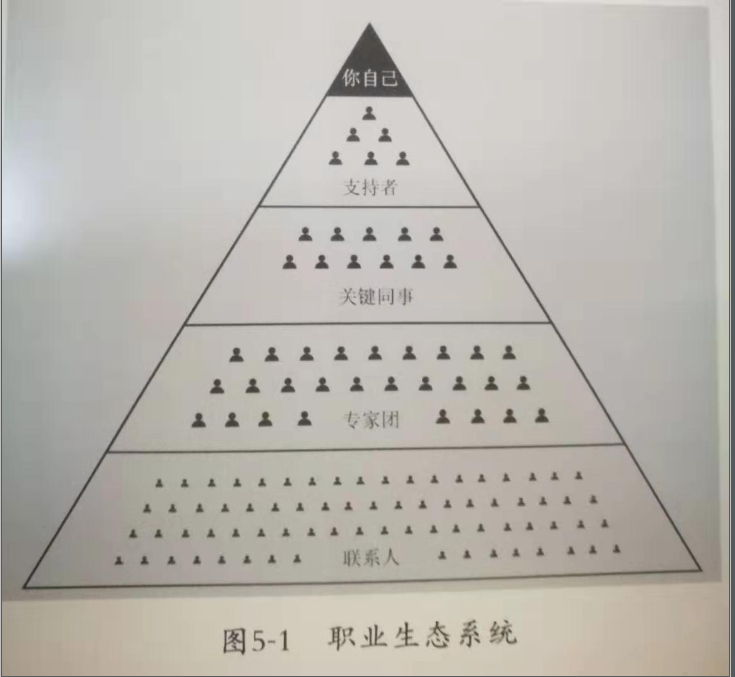
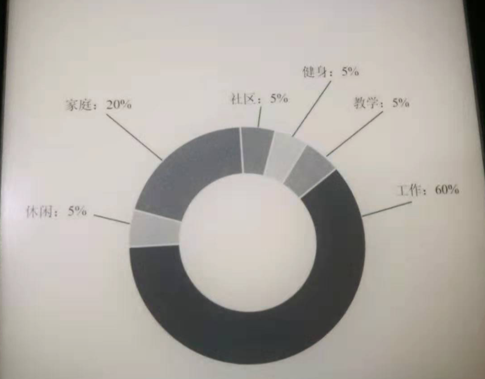
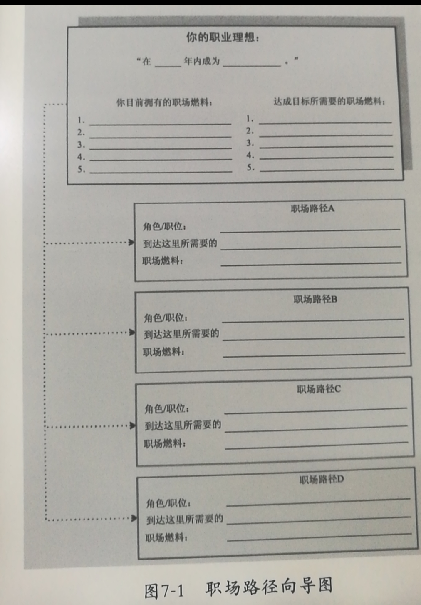
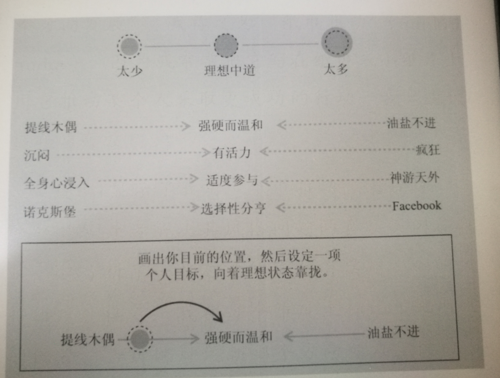

远见
========

##### [加] 布赖恩·费瑟斯通豪


## 前言: 用新思维构建属于你的职业生涯

### 常为工作担忧？可光靠担忧并没有用

可是光靠担忧是没用的，相反，我们应该将精力集中起来，去了解这些**翻天覆地的变化如何创造出一系列崭新的工具、技能和结论**，它们在人们职业生涯的每个阶段都能提供帮助。


我们需要用新的方法来寻找工作，用新的方法来建立可持续的职业生涯。我们需要新的思维方式和新的工具箱。这不仅是方法，而且是稳定、经得起现实考验的策略，我们能用它们在新的职场中生存和发展。

### 个人环境不同，但挑战的核心并无差异

虽然每个人身处的环境大相径庭，但他们的挑战核心并无差异。

> 现状:
> 
> 我们的大学、研究生院和公司也许能教授世界上最好的技术和商业技能，但是世界各地才华横溢的人们却依然不知道，该如何将所有的建议、见解和最佳实践经验统合成一份连贯的职业规划，这令他们感到困惑和灰心。


### 不仅要找到热爱的工作，而且要建立热爱的生活

《远见》可以被分为三个主要部分:

- 第一部分会介绍正确的职场思维、框架和工具。你会在这里了解到，“职场燃料”在职业生涯中是多么重要。你将学会如何思考职业远景、如何分配时间、如何扩张人脉，以及在面对艰难的职业生涯决策时可以使用一个什么样的框架。


- 第二部分会提供一些实用性建议和案例，帮助你应对职业生涯的三个主要阶段。


- 第三部分的内容都以现实生活为基础，主题包括如何平衡职业策略与家庭的关系、怎样处理跨国调动和职场危机。职业生涯并不总是恰到好处，改变的时机也不一定总是完美。


> 《远见》着眼于一个终极问题：职业生涯到底是为了取得成功还是为了发现快乐？

于我而言，构建一段成功的职业生涯的目的并不仅在于找到你热爱的工作，而且是建立起你热爱的生活。


我们需要一种包容了生活中所有方面的工作哲学，它能够指导我们如何保持进取之心并追求成功，同时不牺牲家庭、朋友、健康、理想等珍贵的东西。


> 这些建议正是我提供给那些向着人生巅峰冲刺的新兴领袖们的，是我现在思量自己职业生涯的下一个阶段时会采纳的，也是我的两个千禧一代的女儿朝着前方漫长、可怕而又令人兴奋的职业之路迈出第一步时，我会赠予她们的。

# Part 1 | 远见思维和工具

## 01 | 远见思维：多行动，少忧虑

### 大多数人走在错误的职业道路上

他们将过多的注意力放在近在眼前的下一步上，而不是**整条路径**。他们大都将职业生涯当成一场短跑比赛，然而事实上，这是一场至少长达45年的马拉松。他们更关心下周二的升职加薪，而不是在真正重要的时候，也就是四五十岁时拥有更好的选择。


### 打造职业规划要知道的5件事


#### 1．职业生涯的持续时间长得惊人，包括了三个截然不同的阶段。

职业生涯由三个主要阶段组成，分别持续大约15年时间。这三个阶段之间紧密关联，你在一个阶段的所作所为既可能为接下来的阶段创造机会，也可能带来恶果。


* 第一阶段是强势开局的时候。你在职业上的努力必须着重于为前方的漫长道路挖掘和装备自己。你的**学习曲线要比职位、职称更加重要**。在这一阶段，要为职业生涯打好基础并建立起良好的早期习惯。

* 第二阶段是聚焦长板的时候。该阶段的首要目标是寻找自己的甜蜜区，即**你所擅长的、所热爱的和这个世界所需要的这三者之间的交集**。这个时候你要展现自我，让自己鹤立鸡群，想方设法平稳地走在那条收获最大的职场路径上。你要专注于自己的长板，且大可忽略自己的短板。
 
* 第三阶段致力于实现持续的影响力，以及寻找一条可以稳定延续到60多岁甚至70多岁的新的可持续职业道路。你要在第三阶段完成三个关键任务：**完成继任计划、保持关联性，为自己点燃一团新的职业之火**。


#### 2．职场燃料很重要，因为职业生涯的基础决定结果。

这种燃料有三个主要来源：**可迁移技能、有意义的经验和持久的关系**。

> 随着全球的就业市场不断以不可预测的方式转变，如果没有这样的职场燃料，你就有可能变得不堪一击。


在第一阶段，你需要积累它；在第二阶段，你需要利用它；而在第三阶段，你需要更新和维护它。


#### 3．职业生涯需要通过对时间的巧妙投资来构建。

> 有人之所以能成为精通某一方面的专家或者“大师”，不仅是因为有天赋，而且是因为数千小时的学习、体验和实践。你在工作和生活中如何**投资时间**对你的成功和幸福有深远的影响。

#### 4．职业生涯并不是以线性或者可预测的方式发展的。

你必须时刻**保持探索和学习的状态**。职业机遇会变化，你的人生目标也会变化。当你遇到了新的路径和机会时，要保持冷静，有策略地思考。时刻准备好迎接无法避免的变化，并让自己的职业策略随机应变。

成功的职业生涯既需要自我的规划，也需要良好的运气。自我的规划之所以必不可少，是因为它能让你抓住机遇。


#### 5．职业生涯远不止于一份工作，而是生活的一大部分。

> 这就是为什么你需要一个职业规划的框架的原因，它不仅可以用来甄选工作，而且是一种让职业生涯融入更广阔的人生追求里的整体方法，那些人生追求包括你的亲子关系、跨国工作、未来发展以及终极幸福。


### 实现职业规划要做到的5件事


#### 1．学习`职场数学`，树立正确的长期思维方式。

> 第4章有一些简单但意义深远的问题，能帮助你认识职业规划的整体图景。


#### 2．`盘点职场清单`，梳理你最有用处的技能、经验和关系。

作为这份清单的一部分，你需要评估目前所处的职业生涯阶段，并描绘出职业生态系统。

`职业生态系统`由对你获得的职业生涯成功至关重要的因素构成，包括你的联系人、专家团、同事和支持者。

> 树立职业生涯目标，并根据以下4大黄金问题来得出年度职业价值评估报告：在接下来的一年里，你最大的追求是学习新东西、获得影响力、体验乐趣，还是收获奖励？具体内容请阅读第5章。


#### 3．进行“100小时测试”并完成一份`“个人时间档案”`，从而了解你目前的时间投资状况。

> 你是否将足够多的时间投入到让你变得最成功和快乐的事情上了呢？具体内容请阅读第6章。


#### 4．在尝试建立新的职场路径或者在多个选项中抉择时，运用`“职场路径向导”`（Career Path Navigator）。

> 具体内容请阅读第7章。


#### 5．时刻更新你的职业生涯，`用5大问题挑战自己`。

“尾声”中探讨了5个令人警惕的长期问题，你可以定期使用它们来挑战自己。 

> 我如何避免被机器取代？ 我能在哪里以什么方式找到工作？ 未来我将如何分配时间？ 我会把钱花光吗？ 工作如何能让我更幸福？

## 02 | 3大阶段，聚焦45年职业生涯

> 职业生涯可以被分成三个主要阶段，每一阶段都持续大约15年，且各有各的主导策略。 

> 第一阶段：加添燃料，强势开局； 第二阶段：聚焦长板，达到高点； 第三阶段：优化长尾，持续发挥影响力。

你在规划时需要同时考虑**稳健性和灵活性**。在这样一个越来越透明的世界里，任何成分或结构上的缺陷都是掩盖不住的。


### 第一阶段：加添燃料，强势开局


第一阶段不仅要有耐心，而且要不断行动，为之后收获果实播下种子。这是初出茅庐的时候，是`找到自己的长板和热情所在的时候`，是树立良好工作习惯的时候。最重要的是，这是储存职场燃料的时候。


第一阶段是探索和弥补自身短板的时候。

> 如果你是个糟糕的演讲者，那就去参加相关的培训课程。
> 
> 如果你对待团队成员过于强势或弱势，那就去参加领导力培训。
> 
> . . . 

**学习要比纯粹的成功更重要**。有时跌倒并不可怕，只要你能吸取教训，并将这些经验加以利用就行。


### 第二阶段：锚定甜蜜区，聚焦长板

第二阶段是在你的长板、你的爱好以及这个世界的需求之间寻找交集的时候。

**专注于自己的长板，与能够帮助你、弥补你短板的人为伴**。没有哪个卓越领袖可以面面俱到。


**坦率地承认自己的短板，针对它们招募盟友**，你就可以把大多数时间放在核心长板上了。


将被他人欣赏的价值表现出来，为自己贴上标签，你就会在职场上`树立起自己的品牌`。

> 如果说你和其他强大而善良的品牌都被摆在货架上，那么当带着空闲职位或升职机会的老板来店里寻找能够解决问题的人时，你要做的就是让他们选择你。


### 第三阶段：优化长尾，发挥持续影响力


> 在我看来，职业生涯的第三个阶段却可能异乎寻常地充实和持久。不过这需要恰当的思维方式、预期与准备。

第三阶段的主要目的是确定接班人，即给继任计划画上完美的句号，从执行或领导的角色转变成顾问或辅助的角色。


- 继任计划：

> 我该如何帮助公司的下一代走向成功？这可以是简单、周到的职责和经验的传递，也可以是更正式的领导权或所有权的移交。 

- 顾问和带薪的咨询委员会成员：

> 如果有机会，顾问和委员会成员的职务就是第三阶段中非常棒的工作。但是你必须在第二阶段铺好轨道，才可能走到这被人邀请的一步。

- 创业精神：

> 小型创业并不是年轻人的专利。对许多步入职业生涯后期的人来说，创业正在成为一个可行且刺激的选择。在电子商务的帮助下，创业的门槛已到了历史新低。


- 教　学：

> 于我而言，在回报颇丰的第三阶段经历中，教学是一个关键的部分。大胆想象你所知的东西和你能教授的人。


- 社区：

> 最近的退休人员常常会说起他们原本希望“加入某些社区委员会”，后来却惊讶地发现这些职位的竞争和要求都很高。

要想在第三阶段保持影响力，你就必须**保有活力和关联性。**

> 人们看重历史，但前提条件是它对现在的状况和挑战有所借鉴。如果你连大致了解现状并保持关联性都做不到的话，就别妄想别人会听你的了。

## 03 | 储备3大职场燃料
> 许多人关注的是职业生涯的表相：头衔、晋升、办公环境、薪水和奖励。这些可以算是职业生涯的重要里程碑，但并不是尾声。

如果说读了这本书你需要记住什么的话，那就是**真正成功的可持续职业生涯是靠职场燃料推动的**。

聪明的职业策略应该是，在整个职业生涯中积累职场燃料并不断更新，同时精明地消费它们。

三种基本形式的职场燃料，每一种对获得长远的成功都非常重要: **可迁移技能； 有意义的经验； 持久的关系**。

### 1号燃料：可迁移技能

下面举几个我认为确实能让你与他人拉开差距的可迁移技能的例子。

#### 1. 解决问题的能力

从某种程度上说，世界上任何一份工作都是为了解决某个问题而存在的。你能够分析问题并制订解决方案吗？当你面对一项挑战和一张白纸时，你是否有一两套能解决问题的可靠方法呢？
	
> 不管是与首席执行官还是与新员工对话，我都会在业务中运用的方法之一是，从“客户如何选购这一产品或服务”这个问题入手。
	
有不少理论框架和策略能帮助你提高解决问题的能力。你应当**有意识地往自己的工具箱里添加些不同的方法**，并勇于将几种不同的方法结合起来，创造出适合自己的独门秘方。
	
	todo : 收集理论框架和策略，打造属于自己的方法

#### 2. 说服式沟通技巧

**能将自己的观点以清晰、简洁的方式呈现出来都是一种基本技能**。

> 有的人觉得说服力是一种肤浅或低劣的伎俩。试着改观吧。说服的风格没有定式，从强硬、张扬的步步紧逼到冷静、可信的循循善诱，不一而足。
> 
> 从我的个人经验来看，那些无法说服别人接受他们想法的人在职业生涯中都会受挫、贬值。
a
眼下，世界上最好的说服渠道之一就是`在线视频`。你能凭借时长两分钟、以你热爱的话题为主题的视频吸引超过 1000 次的浏览量吗？当然，视频内容不能是色情的。你应该在接下来的6个月里实践一下，选择一个话题，拍摄一段低成本的视频，发布到网上，瞧瞧结果如何。然后，不断在各方面进行调整、尝试。

测试讲故事的能力时，你会发现一件事：**简单制胜**。

> 很多人，尤其是在他们初入职场时，会认为行业术语、高深辞藻和简称能显得自己更聪明。其实恰恰相反，行业术语和高深辞藻并不能赢得听众，反而会失去他们。
> 
> 你应该使用人们听得懂且能戳中他们痛点的文字和形象。


说服力的一部分来自令人叹服的事实，它能让人们真正有理由相信你。但在这个信息无处不在的世界里存在太多的选择和半真半假的故事，可靠的信息来源却少之又少。

> 当你谈到自己如何**想方设法找到可靠的信息来源并加以记录**时，就会传达给听众一个信号：你做了充分的准备，你的观点具备可信度。

我**尽量每周都至少做一次公开演讲**，哪怕是上班的时候对一群同事宣布今天是某人的生日。最后，在一大群人面前和各种讨论会上，我也能泰然处之了。


> 对于正式的演讲，我会至少花费5个小时去准备台上的20分钟。如果你无法确保自己能在面对面沟通、书面表达与在台上和镜头前发言时做到说服式沟通，那就不如将它当成一项基本的职业挑战，从现在开始就投入时间。


- 意识到沟通障碍并据此调整沟通方法的能力,在一次对话中，可能出现下面的问题:

	* 当两个人使用不同的说法描述同一件事情时，`对话`就发生了。【即复述对方所说】
	
	* 当两个人使用相同的说法，但指的是不同的事情时，`冲突`就产生了。【理解偏差】
	 
	* 当双方没有任何沟通基础时，就会产生沟通断层。这时就说明这两个同事完全无法交流。【沟通断层】


#### 3. 完成任务的能力

> 执行并完成任务的能力虽然再基础不过，但对于漫长的职业生涯具有巨大的价值。尽管每个人都具备一定的执行力，但只有那些能`不畏艰难、持续产出`的人才能真正脱颖而出。

**“人才引力”**：有一种说法是，拥有最优秀人才的公司通常都能成功。

> 我同意这个说法。与此对应的还有一条真理：**有能力吸引和调动尖端人才的个人领袖通常都能成功**。将优秀的人才招揽到身边能让你把工作做得更好，并扩大影响力。这个能力是区分优秀与顶尖的因素之一。


要培养“人才引力”，首先要有正确的思维方式，即认识到，没有人需要为你工作，必须是他们想要为你工作。我将其称为“eBay因素”（eBay factor），即假设你把自己放在网上拍卖，让员工根据为你工作的快乐程度竞拍，


我鼓励年轻的领导者在加入一个团队几年后**评估一下自己的“人才账户”**。你们可以审视自己的每一次关键时刻，试着评定自己的行为对“人才账户”起到了增益还是衰减的效果。


#### 4. 帮助和求助的能力

> 在畅销书《沃顿商学院最受欢迎的成功课》（ Give and Take）中，亚当·格兰特用令人信服的证据说明，成为一个成功的“付出者”（Giver）能让你在生意和生活中都更有效率。

**成功的付出者就是付出超过获取的人，跻身最杰出和最幸福行列的机会会比别人大得多**。

> 效率最高的管理人员有能力通过某种方式的付出来扩大自己的影响力，同时让他人尽可能受益。

就我个人经验而言，人们会朝着他们信任的领导者靠拢。而**“付出”的行为就是一种建立信任的强有力的方法。**


##### 情商（EQ）：

在工作中，我总是在寻找情商起作用的线索。**情商是你理解和连接他人情绪状态的能力**。

	例如，通过阅读某人的肢体语言发现对方的不适或愤怒，或者知道如何解读周围人的社交线索、情绪和非语言的信号。

每个领域要想成为业绩精英，情商的重要性比智商或专业技能高一倍。对领导者而言，区分精英与普通人的标准几乎90%都在于情商。

推荐了一些这方面的好书，其中包括丹尼尔·戈尔曼的《情商3》与布拉德伯利（Bradberry）和格里夫斯（Greaves）的《成功EQ密码》（Emotional Intelligence 2.0）。

> 我鼓励雷蒙德**留意公司里的领导者在人际交往中的言谈举止，分辨其中的优劣**。
> 
> 我让他尽量多发表一些**公开演讲**，因为亲眼看到现场听众的反应是一种很有价值的经验。
> 
> 他应该继续到家乡以外的地方去旅行，离开自己的舒适圈。
> 
> 如果他迫切想要有所进步，就应该报名参加即兴表演或戏剧表演的课程。哪怕这会让他感到很不适应，但没有什么能比这更快推动他去理解情绪并了解如何应对情绪和掌控情绪了。
> 
> 虽然培养情商可能要付出好几年的努力，但这是完全值得的。


#### 5. 除了上文的6项可迁移技能，以下是另外三个我最喜欢的可迁移技能，

#####  1．如何与别人进行眼神交流和握手。

#####  2．如何搜索信息。

所有人都会用搜索引擎来寻找答案，但大部分人都做得不怎么样。他们不知道该如何`核实搜索结果`，不知道如何区分可信和虚假的信息来源，也不知道该如何用清晰、有说服力的方式呈现数据。


#####  3．如何呼吸。

工作要求我们全神贯注，同时保持放松。早在职业生涯的初期，我参加过一些课程，**学习了基础的呼吸和放松方式**。如今，在大型演讲和会议之前，我依然会运用其中的一些技巧。


### 2号燃料：有意义的经验

> 有意义的经验结合起来可以让你在职业生涯中既成为复合型人才，又很稳健。新的经验会让你离开舒适圈，建立新的职业技能。
> 
> 在不同的环境中尝试不同的事情、试验不同的做事方法，这样能创造出更强的决策技能。如果我们一直用同一种方法做事，虽然会变得很有效率，但这种状态很脆弱。


不要让你的职业生涯脆弱不堪。随着职业生涯的发展，你要寻找机会分别到一个大公司和创业公司的环境中工作，要找机会去国外工作或者至少去几个不同的城市，还要努力发起一些新项目、处理一次危机，并在明显存在个人失败风险的情况下筹办一场大型活动或演出。

当人力主管计划雇用或提拔一名新的领导者时，就希望能看到对方领导力多样化的证据:

- 他们创立过新东西吗？ 
- 他们曾经快速扩张过一家企业吗？ 
- 他们曾经拯救过一家濒危企业，使之起死回生吗？

并不一定意味着，你需要到处跳槽才能找到机会获取新的经验。**如果你表现出开放性，并有一点耐心，往往就能在同一家公司拥有丰富的经验**。

有一条是我最喜欢的。我认为，如今身处商界的每个人都应该至少把职业生涯中的一个篇章放在电子商务上，即使只待几年时间。

> 由于电子商务涉及整个销售流程，从产品开发、供应链的运作、营销到客户服务等，所以它能教会你如何用总经理的头脑来思考。
> 
> 你将有机会接触到品牌塑造和用户体验等商业“软技能”，以及利润管理、数据分析等“硬技能”。最棒的是，电子商务的工作意味着你会每天收到即时销售的业绩单。电子商务中的一个职位就像是整个商业的缩影。
> 
> 这是一个多么神奇的个人学习和发展的加速器啊！

### 3号燃料：持久的关系

持久的关系可能是最有效、最耐用的一种职场燃料了，包括了职业生涯中与你相关的品牌和人。

> 如果你想知道哪些雇主品牌的名声最好，可以参考一些榜单，如WPP集团的Brandz“全球最具价值品牌”榜单（World's Most Valuable Brands）或者《财富》的“全球最受尊敬公司”榜单（Most Admired Companies）。虽然你可能无法做到一直为知名公司工作，但要确保你的雇主品牌都是受人尊敬的。


人际关系对你同样重要，每个人都不能落下，他们包括：

#### 你的上司。

> 这是你会感受到的第一号人际关系。没有人比你的直属上司对你更有影响力，不管这种影响力是好还是坏。


#### 你的客户。

> 这些个人联系对任何职业而言都至关重要，在市场营销、销售或专业服务领域尤为突出。如果客户非常欣赏你，当你转移到别的角色、公司甚至行业时，他们都对你不离不弃，这就能说明很多问题。


#### 商业伙伴。

> 你是否正在与优秀的商业伙伴合作，例如能够在你的职业道路上起到支持和推动作用的顾问、合作机构、技术供应商或猎头？


作为一名老将，一方面，你时常会觉得自己应当无所不知，另一方面，你有时还要与后来者竞争。如果你的身边伴有一系列有能力且支持你的伙伴，那是多棒的一件事情啊。


#### 身边的人才。

你是否在职业生涯早期遇见了顶尖的领导者和相关领域的专家？你应该问自己这样一个问题：“如果我自己创建公司，周围的人里，我愿意带上谁，以及他们是否会接受我的邀请？”


#### 找到你的同类。

在过去，许多职场人脉都是围绕着俱乐部建立起来的。如今，职场人脉越来越多地**以社群为中心建立起来**。


我们之所以需要对前文这三类职场燃料进行重点储备，原因有好几个。

- 首先，它们令我们有了选择，即行为经济学家所说的**“选择权”（optionality）**。

	具备深厚的基本技能将使我们能够胜任各种更强大的角色。不管我们是否选择追求这些目标，储备好这样的职场燃料会让我们免遭淘汰。


- 其次，这几种职场燃料可以帮助我们**获得自主力**。

	每天都有行业和公司在经历起起落落，没有人能够准确地预言5年后的职场会是什么样子，更不用说10年或40年之后了。


- 最后，这些职场燃料将**延长我们的职业生涯**。

	现在初入职场的人需要储备的平均燃料至少要能让自己在40年里保持关联性，符合职场需求。
	

### 2．精通一项技能所需的时间：要花多少小时才能在某一方面达到“精通”？

大约需要10 000小时的密集训练和演习，一个人才能在某一方面达到精通。

**成就等于天赋加上练习**。练习并不是在熟练之后才做的事情，而是不断练习之后才能变得熟练。

> 无论你拥有多高的智商或天赋，成功都需要花费超乎想象的时间进行高强度的练习。
> 
> 你对需要学习的技能了解得越多，就越能为职业生涯做最佳决策，从而将你获得长期成功的可能性最大化。


### 3．40岁之后能赚到的个人财富百分比：在40岁之后，你赚到的钱会占你一生个人财富的百分之多少？

> 真正的答案其实是85%～90%。大多数人完全没想到这一点。一个人的个人财富往往在65岁左右达到巅峰，而他们在40岁时的个人财富只有那个数字的10%～15%。

个人财富的积累绝大部分都发生在40岁之后，原因非常简单。

- 第一，根据我们之前的发现，40岁之后的职业年限要比之前的更长，而且往往薪水也更高。
- 第二，你可以享受到复利。
- 第三，当不需要再付房贷和与孩子相关的费用之后，许多支出都会逐渐减少。

### 4．社交货币：你有多少社交网络好友？

> 思考这个问题的目的是，搞清楚根据手上的社交和商业关系，自己拥有多少“社交货币”。


### 5．职场支持者的人数：有多少人能对你的职业生涯和人生带来真正的变化？

我们都会在职业生涯中遇到成为自己导师、老师和支持者的人。他们是支持并在背后褒扬我们的人。他们的推荐为我们带来了工作和奖励。


### 有了技能和规划，才有资格碰到好运气

> 你需要一颗雄心、一份规划、一些准备，以及对节奏的巧妙把握。
> 
> 你需要食物和点心来提供长途旅行所需的能量。你在一个阶段的所作所为在之后的阶段里，要么帮助你，要么损害你。
> 
> 尽管痛苦和困难不可避免，但你还是需要有继续前进的动力。你需要支持者，但你需要独自为自己职业生涯的成败负责。

**职业生涯是技能、规划和运气的组合**。你需要有技能和规划，才有资格碰到好运气。

## 04 | 5个数字，树立正确的职场思维

要想学会正确的思维方式，你需要先跟几个数字打交道:


### 1．职业生涯的长度：用62减去你目前的年龄。算出的结果是你距离提前退休的年数。

[个人备注] 在中国将来这个退休的年龄将进一步延迟。

许多人认为职业生涯到40岁就已经差不多结束了。实际上，就算到了40岁，你其实还没走完一半呢。大部分人都严重低估了职业生涯的长度。

## 05 4大黄金问题，评估职业价值

### 1号燃料的盘点清单

可迁移技能是你在职业生涯中得到的能力，它们能从一份工作被带到另一份工作、从一家公司被带到另一家公司，以及从一个行业被带到另一个行业。 

下面，请将它们一一列举出来。 

- 学位、专业证书： 

- 语言，包括音乐和计算机语言： 

- 上司和同事在你的360度绩效评估中经常提到的优点： 

- 你收到的关于`情商`的评价，即上司和同事对你的社交状况和情感交流能力做出的评论： 

- 你的“人才账户”。历数你至今雇用和（或）提拔过的人，他们在自己的职业生涯中继续获得提高和发展了吗？其中的佼佼者是否愿意再次为你工作？ 

### 2号燃料的盘点清单 

写下一些你有意义的经验，不管是工作之内还是之外的，只要它们可以证明你至今为止的生活和职业生涯具备多样性。 

- 个人旅行： 

- 国外工作经历： 

- 企业管理或创业经验： 

- 社区或志愿者活动： 

- 包含你个人贡献的大型活动、产品发布或知名的项目： 

- 公开演讲、写作或表演的经验： 

- 教学、咨询或指导的经验： 

- 兴趣爱好、业余活动和工作之余的热情所在： 

- 其他生活中的经验和挑战：

### 3号燃料的盘点清单

我鼓励大家定期盘点自己的职业生态系统，确保它们为你提供的是正向支持。职业生态系统在纵向上有许多层次，横向上更是远超你目前的职位和雇主。

#### 1．联系人是职业生态系统中未经改良的原料

定期衡量一下自己有多少职场关系吧。

> 你最近建立过新的关系吗？你的数据库始终保持更新不过时吗？在你的人脉中，有没有哪个值得尊敬的人正在与你渐渐疏远呢？


你在下列平台上大致有多少个联系人？ 

- 领英联系人
 
- Facebook好友 
 
- Twitter粉丝 

- Instagram粉丝 

- 个人邮箱联系人 

- 其他社交平台或网络 

- 你参加的校友会（学校的或老同事组织的）： 

- 其他组织协会或行业协会： 

- 可能对你的职业生涯带来影响的其他重要联系人，这种影响可能发生在今天，也可能发生在将来的某一天：

虽然增加初级联系人可以拓展你的人脉关系网，但**只有被转换成更深层的关系时才能发挥重要的价值**，这种深层关系的建立需要让这些人被你吸引，并跟着你行动。你可能拥有数以千计的初级联系人。但请记住，**这不是一场以量取胜的比赛，决胜的因素是质量和影响力。**


书籍《至关重要的关系》（The Start—up of You）明确地指出：在建立**人脉关系网**和**真正的人际关系**之间存在重要的区别。

- 人脉关系网的构建者的心态是**交易性**的，他们在追求人际关系时只考虑其他人能为他们做什么。

- 人际关系的构建者会**首先尝试帮助别人，他们不会有所保留**。虽然他们心里清楚大部分好意都会得到回报，但是并不会精于算计。他们还会时刻维护自己的人际关系，而不是在需要的时候才想起来。

#### 2．专家团处于职业生态系统中一个较高的层次。

> 这些专家是拥有`特殊的知识和权力、能帮助你取得工作和职业生涯成功的人`。他们会为你的难题提供专业知识和最佳解决方案，这会让你变得更优秀、更聪明。

**最好的方法并不只是请求帮助，而是提供帮助。**你可以在周围的同事圈子里培养这样的团体，也可以将远在天边的朋友组织起来。

当你面对一个毫无头绪的问题时，能够向哪些专业资源咨询呢？这些资源可以是谷歌、专题博客，也可以是个人专家。我们常常需要针对不同类型的问题寻求不同“专家”的帮助。请尝试把它们列出来。

专家来源|咨询的问题
:--:|:--:|
XXX|XXX

> 在工作中，我每周都会遇上棘手的问题，自己根本就不知道该怎么办。但是，在公司内外，我拥有足够广泛的专家团，这令我几乎能在24小时内回答出任何问题。

> 发现一个新的专家是件令人高兴的事情，我会迫切地想要回应他们的请求。

我们也很容易遗忘一些非常出色的专家。我**每年都会至少检查一遍邮箱联系人和领英联系人，提醒自己这些专家往往和我只有点一下鼠标或打一个电话的距离**。


#### 3．关键同事是在目前的公司里对你的发展拥有决定性影响力的5～10个人。

排在榜首的是你的上司，这个角色在各种研究报告中都一直被列为影响职业成功和幸福的头号人物。你上司的上司也是个至关重要的影响者。

某些同事和下属也可以成为关键同事圈的一员。当你在审视自己的职业生态系统时，应当在目前的组织中找到10多个这样的黄金人际关系，将他们列出来。

> 诚实地问一下自己，他们如何看待你？他们会支持你迈出下一步吗？如果答案是否定的，那么你需要怎么做才能消除误解或赢取更好的人际关系呢？

关键同事|关系状态(正向/中立/负向)
:--:|:--:|
XXX|XXX

#### 4．支持者是在职业生涯中帮忙提建议、拥护你、激励你的导师和帮手。

> 他们通常为数不多，大概不到5个人。


写出你认为算得上或者可能成为你的支持者的人的名字。如果你想不出来，可以回忆一下是谁推荐你上大学，或者谁支持你得到了职位或晋升机会。


有三类人生导师：

- 明星，他们是成功的行为榜样，告诉我们如何成功
- 贤者，他们就像苏格拉底，并不为我们提供答案，而是教我们如何思考
- 策动者，他们激励我们，鞭策我们，偶尔迫使我们踏出关键的一步

##### 去哪里能够找到这样的支持者呢？

最好的办法就是**保持耐心和开放，当你找到一名支持者时，要重视并培养这层师徒关系。**这层关系一般不需要太精心的维护。导师倾向于倾听你做了什么，然后分享一些有助于你成功和奋斗的经验。

> 如果你将自己当成一个学生，那就自然会找到老师。
> 
> 在找到了能推动你职业生涯前进的人时，你就要想尽办法帮助他们、为其所用，或者花时间与他们相处。
> 
> 如果你很幸运，能让他们倾听你、引导你，那就像海绵一样用力吸收吧。优秀的导师都希望看到学生全身心地投入学习中去。
> 
> 你可以通过当一个好学生和努力工作的员工，来建立一段人际关系。你还要对他们和他们想要完成的事情保持忠诚和热忱。最重要的是，要感恩。你要`让他们看到他们的影响力，尽早和尽可能地感谢他们`。
> 
> 另外，你也可以`试着当一名导师`，比如在非营利性组织或大学里担任志愿者，或者帮助渴望在你的领域有所进步的学生。成为别人的明星、贤者或策动者是一种极好的方式，它可以用来向当初站在同样立场上帮助你的人表达敬意，而且还能让你感觉到最深刻的喜悦，这种喜悦来自对别人的影响力。


一旦找到了一名导师或支持者，**首要任务就是欣赏他们，并与他们保持联系**。时不时地给他们发条消息，**告诉他们你现在的状况，分享你的成功和失败，向他们寻求建议**。记住，对你的导师而言，这类沟通并不是什么负担，而是一种奖励。


**每年至少审视一次你的职业生态系统，如图5-1。写下你在4个层次，即联系人、专家团、关键同事和支持者中所获得的关键关系。**

<div align="center">  </div><br>

#### 5．你自己。任何职业生态系统的核心都是你自己。

你就是你自己的品牌经理。作为品牌经理，你的工作之一就是关注职业生态系统，确保它积极、活跃地发展。

### 4大黄金问题

基本上，你每年都要为接下来的一年设立目标，并回顾过去的这一年。下面这4个问题有助于你完成这项工作。

1.  我是否正在学习和成长？ 
2. 我是否正在对某些人、现在的公司，乃至整个社会拥有影响力？ 
3. 我体验到乐趣了吗？ 
4. 我是否得到了适当的奖励，并创造了经济价值？

在年末，花一天的时间反思一下自己在过去12个月里的贡献、进展和成果。 

接下来，针对每个问题，分别按10分制给自己打分。

- 在评价学习成果时，你可以考虑自己增加了哪些新的可迁移技能、有意义的经验和持久的关系。
- 在评价影响力时，想想你的工作给客户、同事、公司和社会整体带来了多少益处。
- 乐趣则是一项偏个人的评估了。工作对你来说是乐园还是恐怖谷？
- 至于奖励，要记住不能光看基本的薪水，而要衡量完整的收入，包括基本薪水、福利、津贴、假期、弹性时间、报销或补贴，可能还要加上你在积累的所有权或股份的任何变化。

> 不要纠结于数字，关键在于，你能定期评估职业生涯中那些重要的动力来源，并做出建设性改变。

#### 职业生涯第一阶段价值评估：权重相等

目标领域|权重|自评分(满分10分)|职业价值
:-:|:-:|:-:|:-:|
学习|25%|9|225|
影响力|25%|7|175|
乐趣|25%|6|150|
奖励|25%|6|150|
总分|-|-|700|

表5-1　年度职业价值评估案例1 将4大问题的权重和自评分分别相乘，再把结果都加起来，


将4大问题的权重和自评分分别相乘，再把结果都加起来，你会发现这个人的年度职业价值分数为700分。这是个非常健康的分数。

**在放弃一份学习和影响力得分都还不错的工作时，请务必小心谨慎，因为这些优势是很难复制的。**


#### 职业生涯第一阶段价值评估：权重不同

目标领域|权重|自评分(满分10分)|职业价值
:-:|:-:|:-:|:-:|
学习|60%|9|540|
影响力|10%|7|70|
乐趣|10%|6|60|
奖励|20%|6|120|
总分|-|-|790|

随着职业生涯的推进，此人可能会调整分配给4大问题的权重，这时就需要让分数更加平衡一些，才能保持自己对职业生涯的满意度。

#### 职业生涯第二阶段价值评估

目标领域|权重|自评分(满分10分)|职业价值
:-:|:-:|:-:|:-:|
学习|20%|5|100|
影响力|10%|3|30|
乐趣|10%|4|40|
奖励|60%|9|510|
总分|-|-|710|

以奖励为主要导向的职场人需要确保以下几点：

- 1）他们所在的职业环境有奖励优异表现的健全体制；
- 2）他们完全明确自己的成功标准，并有信心达成愿望；
- 3）他们不会让其他因素长期停滞不前。


在职业生涯中，你应当时刻检讨自己的目标，仔细分配权重。权重的分配可以且应当每年有所变化。**不要让金钱完全决定你的职业满足感，请始终为学习、影响力和乐趣留些空间。**


#### 职业生涯第三阶段价值评估

目标领域|权重|自评分(满分10分)|职业价值
:-:|:-:|:-:|:-:|
学习|20%|7|140|
影响力|50%|9|450|
乐趣|20%|7|140|
奖励|10%|3|30|
总分|-|-|760|

此人现在感受到了热切盼望的影响力，并佐以适度的学习和乐趣。如果奖励变得非常重要，那么这条职场路径就难以维系了。但是对于以影响力为第一追求的人，这条路径非常合适。

## 06 100小时测试，合理投资时间

> 通过审视自己的时间投资的实际情况，我们就能知道自己把重点放在了哪里，以及哪些方面正在为我们追求的结果让步。时间档案会告诉我们，为了变得更快乐、更成功，可以在哪些方面做出取舍。

### 3个100小时

我们平均每周都有大约100个小时是清醒的，所以你也可以轻而易举地画出这样一张图。我将自己的100个小时分散到了几个大类中，例如工作、家庭、健康、教学和社区。你并不一定要使用完全相同的分类方法，也不需要把时间精确到小时。

<div align="center">  </div><br>

一位经理在40岁时倒下了，在将近两年的时间里都无法工作，差点因此而崩溃。我认为，他的**时间档案缺乏多样性**，这是导致他崩溃的一个显著因素。把所有时间放在工作上必定导致能量耗尽，这就好比一份极度单调的食谱。我特别喜欢吃鸡，但是永远只吃鸡也会让我感到厌倦和狂躁。同样的道理也适用于工作，**为了激发斗志和恢复活力，你至少需要改变一下节奏**。


### 关注时间饼图的高效能部分

> 每年至少估算一次自己的时间档案，这会给你带来相当多的启发。
> 
> 世界上并没有什么神奇的分配公式，也没有完美的时间档案，所以它才被称为是“个人的”。我们对工作和压力的忍耐力各不相同，对社区活动、工作甚至家庭活动的喜好也并不一致。


我还是得出了一些值得分享的观察结果和建议:

- 许多人都把注意力集中在饼图的工作部分。这是个很好的起点，因为众所周知，努力工作始终很关键。

- 但是，**不少更有意思的变化都发生在其他部分中**。比如，教学和社区方面的活动似乎能对幸福和成功产生超越时间占比的影响。

- 学习、提供建议以及帮助他人会对我们的精力和影响力带来深远的影响。


	> 因为这张饼图的面积是很难扩大的，所以我们不得不做出艰难的取舍。持续缺乏睡眠所带来的有害影响已经有诸多报道了，科学研究强有力地指出，欺骗自己不睡觉是一门亏本的生意。于是，有些人转而将多任务处理当作最佳答案。

- 当我们必须对时间档案做出艰难的权衡，削减一部分活动的时间时，**我强烈建议你不要将某项非工作的重要活动彻底删除。你可以削减它，但尽可能地不要完全删除它。我们是被习惯驱使的生物，如果一个习惯被剪除，那么要重新建立就难上加难了。**


### 前摄时间迁移法

压力的最大来源之一就是工作和家庭之间的冲突。

> 在过去的20多年里，我经常出差，通常一年有超过150天的时间都在路上。我发明了一种叫作“前摄时间迁移”（proactive time shifting）的方法，下面我来展示一下。我的女儿艾莉森的生日在9月份，几乎每年都会与我的工作和出差的繁忙时段撞到一起。所以我就会使用前摄时间迁移的方法。

前摄时间迁移的第一个**要点在于，它必须是真正前摄的**。要知道，我跟艾莉森打招呼的时间是在七八月份，而不是等到她生日的前一天，


**提前检查你的日程表，看看是否存在可能的冲突和危险地带。**如果有的话，就通过成熟的对话商议可能的选择，尤其当对象是孩子时。


除了前摄时间迁移，与我交流过的成功人士大都**将界限和专注列为应对忙碌职业生涯的策略的重点**。

> 我曾经以为，自己能够在翻看工作邮件的同时享受所谓的家庭时光。但事实上并不能，我需要更明确的界限。
> 
> 我更适合在短时间内专心致志地工作，而不是在工作模式和家庭模式之间不断切换。
> 
> 当我休假时，也采用一样的做法。尽管不可能长时间地完全脱离工作，但我依然尽力将工作方面的联系集中到一个广而告之的时间段里。比如我宁可在一周的假期里，把周二和周四的早上6点半到8点半的时间抽出来集中处理公事，也不愿每时每刻都走在一朵随时会“劈”下工作的乌云下面。

### 碎片时间的回报

**社区工作和志愿者活动可以起到很好的激励作用**，即使是小试牛刀也成效显著。

> 在我看来，还是越早越好。我一直对许多忙碌的年轻人感到惊讶，因为他们会想方设法从日程中挤出一两个小时去做志愿者。


无数的证据表明，即便是**定期将少量时间投资于健身，也会带来很大的回报**。


> 养成健身的日常习惯是很重要的，最好是能每日健身。当我们很忙或很累的时候，就很容易减少健身的时间，而这种时候我们恰恰最需要它。无论是瑜伽、曲棍球、动感单车还是跑步，将它变成生命中的一个日常习惯会给你的职业生涯带来更强劲的动力。


**通勤是一个经常能被挤出时间用于其他投资的地方**。

> 有些人将地铁通勤时间转变成了一段读书、写作的高产出时间。还有人一边走路上下班，一边听着教育播客或有声书。这是学习一门新语言、探索行业中的新趋势，或者培养新的职业技能的好方法。
> 
> 如果通勤时间正在被你浪费或对你来说是一种折磨，那么你可以将它投资到哪些方面，从而取得更多的乐趣和产出呢？你是否还有什么可以利用的碎片时间呢？

## 07 职场路径向导，做出正确的职业决策

**如果你的价值观很明确，做决定就变得更简单了。做出有益决定的关键是尊重未来的自己。**

在职业生涯中，我们会面临许多决策点和十字路口：

> 问一些问题：我会赚得更多吗？它提供的头衔是不是更诱人，或者假期更多、医疗福利更好？ 

> 这些技术上的对比并没有击中要害，你需要在更大的环境下权衡自己的选择。

学习职场数学能帮你树立起正确的思维框架；思考职业生涯的三个主要阶段能提醒你当前在这漫长旅程中的位置；盘点一下职场清单，总结目前的职业生态系统，这会让你了解自己的技能和关系的状态；仔细审视你的时间档案能帮你弄清在职场和生活中可以做出什么样的平衡调整。做完这些，你就万事俱备，可以做出一些明智的决定了。


### 我已经数百次地运用**职场路径向导**来帮助人们应对种种选择。
首先，我们要回答三个问题。 

- 1.你的职业理想是什么，或者至少假设一个你可能想要达到的目标。 
- 2.你目前手上有什么职场燃料？ 
- 3.你需要什么职场燃料才能实现这个终极理想？

> 这就鼓励大家不仅要考虑职位选择的具体细节，而且要`思考整个职场路径`，以及这一具体的决定是会为你接下来的路打开更多的门，还是关上更多的门。

<div align="center">  </div><br>

### 你需要什么职场燃料才能实现这个终极理想？

我看了一下自己认识的20个最成功的首席执行官的领英档案，其中只有半数拥有工商管理硕士学位。

努力获取硕士学位的原因因人而异，但你需要确定它会给你的职业生涯带来什么样的特殊价值，思考它能否： 

- 增加你目前不具备的可迁移技能？ 
- 帮助你重塑自我，改变职业生涯的方向？ 
- 建立新的人际关系，并拓展职业生态系统？ 
- 获得你目前没有的重要证书？ 
- 加速你的探索步伐，即通过实践验证自己真正擅长和热爱的东西？

### 权衡投资回报率

> 如果你想为自己算一下这本账，可以考虑一下工商管理硕士本身的成本，也就是它的学费、书本费、物料费，以及可能的额外差旅、生活和居住费用，有的人还有学生贷款的利息。如果你准备辞职去进修，那么还要加上一两年内都没有薪水的机会成本。

### 快速成长才能获得长远成功

如果要成长得再快一点，你就需要一份满足以下条件的工作： 

- 你周围都是比你聪明的人
- 你有失败的机会
- 公司有让你这样的人肩负重大责任的传统

> 找到一家至少有30%的人都比你聪明的公司，因为你通过向周围的人学习而获得的成长速度是最快的，所以这些人就应当分外出色。

有一种简单的方法可以看出公司里的人有多聪明，那就是看看他们**在招聘时的挑剔程度**。你应该选择一家招聘流程非常困难，往往也很冗长的公司，在这样的公司招聘中，你得先认识许多人、完成一个项目，并且通过几场令人精疲力竭的面试。

当你有33%～66%的概率失败时，成长的速度也是最快的。**要想精进，就得主动站在可能失败的立场上**。有一个现象非常常见，那就是人们会选择一份百分之百会成功的工作，尤其是刚毕业的学生。尽管板上钉钉的成功一开始会让人感觉很棒，但并不能助人成长。你应该寻找一个能让你参加高失败风险项目的组织。


假设你是一个有远大目标的人，想要持续不断地成长，那就**一定要找机会晋升，并承担越来越重的责任**。那些有相应的机制并且增长速度很快的公司是最有可能快速提拔你的。寻找一些与你背景相似又加入了该公司的人，看看是否有人被赋予了重大的职责。


### 在做出决策时厘清正确的思维方式

我们要警惕一些人类天生的偏见，它们会在不知不觉间渗透到我们的决策制订过程中，职业生涯决策也不例外。

- 我们总是会低估在未来才能兑现的好处，这种现象被称为**‘时间贴现’**（temporal discounting）。

- **损失厌恶（loss aversion）**的效应：“人们对后果和风险看得比好的方面更加清楚。我们的美梦很模糊，但噩梦却很清晰。”

意识到自己可能对现状和逃避风险存有偏向性，这一点很重要。同样至关重要的是，**在做出职业生涯决策时厘清正确的思维方式，不要因为老板或猎头的压力而`匆忙做决定`。**

**发现新机会是有益的，毫无意义的变化则是有害的。**

> 先在目前的公司里至少找三个人聊一聊再做决定，这三个人可以是你的上司、人事经理以及组织中另一个值得信赖的人。
> 
> 你应该首先在目前的公司内部寻找解决的办法，这个时候往往就会出现一条重要的新消息动摇你的决定。


**在老板面前表达你的野心是一件健康而有益的事情，不过，你给出的目标应该与自己的职场路径和时间规划有关**，而不一定是眼下的解决方案。如果你只给公司留出几天的时间对你的最后通牒做出回应，那就必须有承担后果的心理准备。

> 你必须要厘清自己的理想、技能和选择，并完全确定自己对目前状况的推论、假设都是正确的；除了职位，你更需要考虑的是工作内容和学习曲线；做好承受压力和承担风险的准备。在这个过程中，感到害怕是很正常的。


**如果你的决定是离开，那就要优雅地走。**

> 人们常常在离去时留下那句“后会有期”，这并不是一句虚言。从前的同事和员工是你职业生态系统中一个至关重要的部分，他们会在接下来的许多年里对你予以评价和评论，他们会在各自目前的公司和将来的工作场所中寻找人才，他们会成为你的顾问、客户和影响者。
> 
> 你应该在交接工作时**表现出勤勉和责任感，适当地弥补一些损失，并将感谢的话说出来**。


# Part 2 三大职业生涯阶段

## 08 第一阶段：加添燃料，强势开局

流浪者未必都迷茫。 ——J．R.R．托尔金（J.R.R. Tolkien）

> 如果人们对职业生涯早期的期望能更现实一些就好了。
> 
> ”整个第一阶段往往长达15年，是一个学习和探索的过程，充满了尝试和错误。这时并不是为了找到一份你每天都津津乐道的神话般的工作，而是要找出你擅长什么、不擅长什么、喜欢做什么，以及不喜欢做什么。

第一阶段的策略很简单：**步入职场、迎接新发现，并为前方的漫长旅程储备职场燃料。**

### 给首次求职者的8个小提示

**端正心态**: 你正在竞争为数不多的职位，而竞争对手遍布全球，他们至少都跟你一样聪明、有魅力、有天赋。没人欠你一个职位。准备好被拒绝吧，而且可能会不止一次。

针对首次踏入职场的人，我有一些小提示。

#### 1．利用在读的时间储备早期形式的职场燃料。

其中的关键并不是你具体修了哪些课程，不是你平均绩点（GPA）的小数点后三位，也不是你加入过的组织，而是你为未来打下的基础。

- 可迁移技能：

> 作为一个正在学习的个体，你所选择的课程是否能提供未来用得上的关键技能，如解决问题、团队协作的能力以及求知欲等？ 

- 有意义的经验：

> 你正在利用大学的时光探索那些对将来有益的东西吗，包括课外活动、领导力、旅行和实习机会？ 

- 持久的关系：

> 你正在认识同学、老师、专家、导师及其他希望能在未来的10～20年里保持联系的人，并建立关系吗？


#### 2．制订求职作战计划。

你可以通过建立电子表格和数据库来帮助自己找到第一份工作。作战计划能让你目标明确，并保持活跃。

- 首先，根据行业、位置、规模、公司知名度，以及朋友、家庭、就业辅导员等的推荐，列出一份可能对你感兴趣的10～20家公司的初始清单。

- 接着开始与这张目标清单里的公司和行业中的个人建立联系。

- 一拿到目标公司的联系人信息，你就应该整理归档，包括公司的网站、电子邮箱地址、领英档案和电话号码。

- 记录下你对每家公司采取的行动，以及对方的回应或下一步动作。

- 时刻记得职位申请的最后期限。

一定要**管理好一份显性机会的清单**，不要为了试图同时跟踪数百个机会而忙得焦头烂额。

#### 3．积极参与校园招聘。

许多高校都会举办校园招聘会。我强烈建议大家尽量多地参与进去。


了解一下那些你不想效力的公司和行业也是有利无害的。如果你喜欢哪家公司，那么可以尝试一对一地沟通一下，例如拿一张名片、记下一个电子邮箱地址，或者后续再咨询。好好利用校园招聘资源，虽然你不能光靠它们来找工作，

#### 4．高效地进行在线申请。

通过网络搜索和分析研究，你会知道谁在招聘，以及他们提供的具体职位。申请吧，但要注意最后期限。

将你的简历草稿给一位或多位信得过的顾问过目，比如身处这个公司或者至少这个行业的人。听取建议，一击制胜。

与其花4个小时鼓捣一份可能没人会看的“完美”求职信，不如将这些时间转投他处，为你的求职行动寻找15个新的联系人。


#### 5．最重要的是，用好你的联系人。

市场营销有一句金玉良言，同样也适用于求职，那就是**有关系可以大幅提高你的反馈率**，所以要多多运用你的联系人，比如导师、校友、朋友、父母、其他家庭成员、邻居等。

罗列一份长长的清单，将你相信能帮到你的人写下来。

> 给他们排个次序，比方说，最近刚入这个行业的朋友和熟人就会很有帮助，目前做到该领域高管的人也肯定不错。还有，不要忘了那些对你很熟悉的支持者，他们能鼓舞你，并且真心实意地帮助你取得成功。

有一种极好的建立新关系的方法，那就是**好好利用校友网络和领英这样的人才数据库**。

> 在校友目录里找找，有没有哪位校友会成员就职于你的目标公司。到领英上瞧瞧，有没有哪个在目标公司工作的人与你来自同一所学校。

人们其实很愿意聊聊他们的工作。现在，让我们**从列清单开始。一封简洁而有个性的电子邮件会给你开个好头**。

```
亲爱的某某： 
	我是__________。我在双方都认识的人的介绍下写信给您。 
	
	我正在求职，特别想要了解X行业，您的建议将很有价值。您能否在下周安排一次20分钟的电话咨询或会面呢？ 
	
	我将非常感谢您所给出的建议。 
	
	祝好， 
	
	你的联系信息 
	
	附上你的简历

```


**抓住重点，表达敬意，提出简单的后续要求即可。**

> 你应该请求他们为你留出一小段时间，15～30分钟就行，因为大部分联系人都很忙碌。提议的见面时间应当就在近期，最好是下周左右，这样可以表达出诚恳的紧迫感。他们要么回信答应你，要么就不回信。
> 
> 如果答应的话，你就可以确定是打电话还是见面，时间是10分钟还是几个小时。我的建议是接受对方的条件，尽可能地利用好它。
> 
> 如果你在四五天后还没有收到回应，也不要慌张。再发一封简短的补充邮件，并附上上一封的原文和简历。

```
亲爱的某某： 
	我依然很想了解您关于Y行业的建议。 
	
	您能否在这周或下周通过电话与我交流20分钟呢？我将诚挚地感谢您给出的任何观点和建议。 
	
	祝好， 
	
	你的联系信息 
	
	附上你的简历
```

> 并非所有人都会回信，这很正常。欢迎来到这个拒绝的世界。


#### 6．在与联系人见面之前，做些功课。

- 在有维基百科和领英的世界里，如果连对与你对话的人和他们**所在行业的基本信息**都一无所知，就太说不过去了。

- 每一次碰面都是一场面试，即使你觉得这只是闲聊。**准备好一些问题，做好笔记，事后再写封感谢的电子邮件。**

- 你的联系人正在考虑是否交你这个朋友，所以让他们愉快地做出决定吧。你不仅要为面试准备答案，还要**花同样多的时间准备一些有水平的问题[准备一些好问题是一般人经常忽视的方面]**。

我曾被问过一些很有意思的问题：

- 这个行业有什么特别之处？ 

- 你喜欢或不喜欢这份工作的哪些方面？ 

- 在你的公司取得成功需要哪类技能？ 

- 你是怎么得到这份工作的？ 

- 你们公司的企业文化是什么样的，与其他公司的有何不同？ 

- 人们现在都是如何进入你这个行业的？（可能与过去有所不同。）

-  有什么挑战会让你彻夜难眠？ 

-  你认为这个行业的引领者是谁？ 

-  你知道你的公司有什么合适的职位空缺吗？（直接问，没关系。）

还有一个你每次都必须提出的万能问题： 

- **你能不能再推荐一家公司或一个人，让我跟他或她聊一聊？**

#### 7．但是，找到第一份工作依然难于上青天！

在每一次成功的求职背后都有两个关键点：**成功的意愿**以及**联系人与支持者组成的后援团**。

> 微小的成功对于培养动力和信心能起到很大的作用，比如收到第一次面试邀请或考取一门新技能的证书。没有人能一下子就找到工作，大多数电子邮件都会石沉大海，面试也常常会被取消，职位空缺的时间会被延后甚至从此杳无音讯。

#### 8．探索。

即使你已经脚步入了职场，探索之旅也并没有终止，而是刚刚开始。你需要弄明白自己擅长什么、热爱什么，以及这个世界需要什么。

在职业生涯的**头几年里要耐心和开放。初期的这些时间应该被投入到竞争力、经验和关系的建立上。**


### 每个成功的创业者都要直面质疑

我还从来没见过在第一个想法上就成功的创业者，而且每个成功的创业者都要直面质疑，并做出很大的牺牲。

> 亚历克斯的经历:
> 
> 磨炼自己在广播节目制作、活动策划和邀约技巧方面的能力。

> 作为环球唱片的实习生，他一心想从公司高管的身上学习经验。“我一直请求他们给我5分钟时间，问他们‘你是怎么做到这个程度的’。
> 
> 亚历克斯的经历中令我感触最深的是，他不可动摇的热情和恒久不变的率真的结合。他的眼睛一直注视着回报，并且不断优化自己的方法。

**白天严格遵循计划才能给夜晚带来开放的选择。**

### 成为你自己的品牌经理

> 利用第一阶段养成良好的职业习惯，并储备职场燃料。最重要的是要成为“你自己的品牌经理”。不管你喜不喜欢，雇主们都不会停下收买人才的步伐。

请利用第一阶段培养好成功的职业生涯所需的技能和习惯。多多见识，全身心投入，**成为某方面的专家，学习高效的沟通技巧，建立声望，寻求反馈，并创造价值。**


### 了解更多公司情况，成为某方面的专家

如果你认真对待自己的职业生涯，那就需要了解更多的情况，搞清楚公司是怎么运转的：它怎么建立的，它的理念是什么，它如何赢利，它的关键人物有哪些，以及它的愿景如何。

> 做好本职工作，阅读公司的年报，如果能找到外部分析机构对公司的评估就更好了；
> 
> 在茶歇时间，在新老员工中打听公司的内部消息；
> 
> 通过加入公司内部的俱乐部、团队或职业社交网络来提高参与度；
> 
> 主动在公司的活动中帮忙，并且尽心尽力；
> 
> 慢慢地建立由你的联系人、专家团、关键同事和支持者组成的职业生态系统。

可以在职业生涯的早期，选择一些专题去钻研，逐渐成为别人咨询的对象。你磨炼的不一定得是震惊世界的高深技术，一些常会出现的问题或专题就可以。

何不拿出一个高层领导或客户正在苦思冥想的具体问题，跟你的老板讨论讨论呢？把它当作一个为期两周的秘密任务，从各个角度研究一番。翻阅你手上的资料，在一份简短的5分钟展示中给出你的解答，将你的论点和假设凸显出来。然后跟老板商量一个合适的时间，用5分钟完成一场重磅表演。**展现你的才华，仔细倾听观众的反馈，并反复这么做。**


### 高效沟通，并选择正确的媒介

利用职业生涯早期的每一个机会磨炼你的沟通技能，这不仅限于你说什么，而且包括你怎么说和在哪里说。

为了条理更清晰，我会教大家在进行任何沟通之前先写下一份简单的大纲，包括对着镜子练习时也要这样做：

- 首先，**话题是什么**？

	我们的听众的注意力正在不同的电子邮件和会议之间快速切换，有一半的时间他们完全不知道我们到底在说什么，所以每一次你都要说得一清二楚。 
	
- 其次，**写下你的三个重点，加上用于佐证的事实和原因加强说服力**。

	这意味着你既有观点，又有支撑它的证据。 
	
- 最后，**直白地说出你希望听众接下来怎么做**。

	这样一来，你的沟通至少是有力和清楚的。这能让你领先于世界上80%左右的人。

**要想真正地出类拔萃，你就得成为一个能把故事讲好的人。**尽管并非所有人都有这样的天赋，但通过刻意练习，我们都有机会成为一个好的说书人。


> 我会看比尔·克林顿和史蒂夫·乔布斯这样的演讲、说服大师的视频，我也会对自己的演讲视频进行评估。
> 
> 学习、实践，然后消化。


- `电子邮件`是一种出色的媒介，可用来快速传递事实和情感中立的信息，比如“会议时间：中午，会议地点：7B房间”，


> 使用`短信或电子邮件`来开始沟通是没问题的，但在信件结尾处一定要用更加私人的方式：“哇，这真的是个很重要的问题，我们必须谈谈。我们可以明天早上9点通个电话吗？”

- `面对面的会议`依然是所有沟通方式中最宝贵和有价值的。

- 我想分享一下关于`书面文字`的一点想法。尽管这个世界已经数字化了，但书面文字依然保留着它优雅的一席之地。

> 我现在依然会给别人定期发送明信片、手写的笔记或信件，因为这是表达真挚情感的最佳方法。在工作和生活中，有什么能比“恭喜”、“很高兴有你在”、“谢谢”、“对不起”和“节哀顺变”更能传达情感的呢？


### 纸巾推动，向理想的领导力中道靠拢

在第一阶段的某些时刻，你可以将时间和精力投入社交声望的建立中，即**建立你在社交平台和整个行业的声望**。

- 你的社交声望可以通过**参加行业协会、写博客、演讲等方法来建立**，这些都是提高专业技术水平和改善职业生态系统的良好途径。

> 你要首先确保打好`坚实的基础`，要想办法在自己的公司里创造强大的产品、习得真正的专业技术，并享有良好的声誉。

- 找出与你的工作切实相关的6～10个因素，请别人对你的表现和风格提些反馈意见。

> 它不会直接对员工说“你是个糟糕的领导者”，而是说“我们讨论的是这样一个领导力的指标，你现在处于这里，接下来要往这个方向发展”。
> 
> 我称之为“纸巾推动”（napkin nudge），因为我常常把它写在纸巾或小纸片上，用它推动某个人采取更成功的行动。

<div align="center">  </div><br>


### 理解自身的价值，为自己的贡献争取公平的奖励

首先，判断报酬和获得的认可合不合适，**看的是贡献，而不是资历**。

- 问题在于你给公司带来的价值。搞清楚公司对你这个职位的期望是什么，尽可能完美地满足它。当你想要评估自己的绩效和报酬时，首先将你的贡献列出来，包括**“硬”贡献和软指标**。

- 找你的上司一对一地聊一聊，最好再找至少一名导师沟通一下。问问他们，**你所关注的优先事项和目标是否正确**，也就是说，它们是不是对于公司及其业务有真正价值的东西，而不是细枝末节的小项目。

- 如果你想加薪或升职，那就得**挑自己表现好的时候提出来**。如果有升职的计划了，那你就得想想有没有可靠的候选人能接替你现在的职位。

- 请围绕着你的**继任计划提出一些可选方案**，让他们能更放心地支持你的升迁。如果短期内看不到晋升的希望，那就可以与你的上司一同制订一份计划和时间表，试着改变现状。

- 在衡量其他选择时，要**着眼于大局**。在第一阶段，要问自己什么东西会带来最长的学习曲线和最多的职场燃料，也就是什么会为你的职业生涯创造更多的正能量。


### 一杯咖啡，导师关系加速器

**导师关系是最强大的职业生涯加速器之一。**在第一阶段，你应该时刻记住这一点，因为这件事做得越早越好，而一杯咖啡则是最强大的导师关系加速器之一。

> 对于像与他人共饮咖啡这样稀松平常的事情，我们很容易低估其影响力。
> 
> 没有任何威胁性。它让我们在一种非正式的环境中更轻松地分享想法和信息，这样的非正式会议能带来巨大的潜力。
> 
> 不同于大型职业招聘会，共进咖啡所提供的一对一接触能产生更高质量的联系和更深厚的导师关系。

## 09 第二阶段：锚定甜蜜区，聚焦长板

> 第二阶段最成功的领导者能出色地统一他们的热情所在和核心长板，同时在很大程度上忽视自己的短板。
> 
> 你要不断问自己这三个难题：我擅长什么？我爱好什么？这个世界需要什么？

在第二阶段则要**创造真正的差异**。


### 精通的秘方就是意愿和时间

> 困境:
> 
> 在20多岁，甚至可能30多岁的时候，不管我们对工作是否有热情和兴趣，我们都可以把工作做得非常好。因为我们年轻、充满活力，我们的满足感主要来源于工作之外。
> 
> 但是到最后，由于与这一领域缺乏深度的联系，各种困扰就会出现，这往往会发生在我们40多岁的时候。我们会感到越来越无法投入工作，竞争力不断下降。我们天生的创造力已经快耗尽了。我们无法关注所在领域发生的变化，因为我们已经脱轨。更年轻、更有创造力，而且更廉价的人很快就会取代我们。

当我们充满干劲时能钻研得更深。如果这个主题令我们感到兴奋，如果它能激起我们最深的好奇心，或者如果我们为了丰厚的利益而必须学习，那么我们就会投入明显更多的注意力。我们吸收的东西会沉淀下来。

精通的能力并不是遗传的。**如果我们愿意投入高专注度和足够的时间，就会精通任一技能。**

> 练习，尤其是在开始的阶段，从来算不上有趣。为了能撑过这些时刻，你就不得不爱上这个领域。你必须为有可能发现或发明某种新东西而感到激动万分。 不然的话，你就会放弃。没有什么精通或力量能离开热情。

### 保持一直向前的动力，就能持续成功

托德崇尚“技能冲刺法”，即以90天为一个循环，**为提高某一项特定能力而进行周期性密集训练。**这也反映出托德的成功哲学：这是一种持续改进的不间断过程。

只要你能保持一直向前的动力，就能持续成功，即使中间有些挫折也不碍事。“总有些事情会失败，”他说，“这是不可能彻底掩盖的。但是你可以决定的是，是否从中吸取教训。”

### 把眼光从小圈子中解放出去

**理清你的财务。**财务是大部分艺术组织的阿喀琉斯之踵。充分理解损益表、预算和成本控制，想清楚如何产生收益，而不是守株待兔。你的头号任务是为组织赚钱或筹集资金，所以人际交往并不是什么蠢事，而是必须做的事情。你并不一定得叨扰别人或乞讨，而是寻找用互惠互利和资源置换的方式来建立人际关系的机会。

### 你必须自己帮自己开门

学习如何创作有说服力的演讲、如何推销、如何营销。

> 必须自己帮自己开门，不停地问自己‘另一边有什么，我为什么不能去呢’。永远不要停下对未来的规划，要努力让自己成为幸运儿。

### 作为领导者，你的巡航高度如何

人们在第二阶段面临的一个主要烦恼就是如何**从执行者转变为领导者**。如果不通过增加工作时间来扩大影响力，让第一阶段取得成功的那些方法往往就并不适用了。问题的关键就在于“巡航高度”。


你要能在高空中飞行，分析战局形势，找出主要问题或机会；一旦发现目标，你就要具备追踪并粉碎目标的能力。

首席执行官要能直击问题的核心，并在完成任务之前亲力亲为、参与其中。但是一旦问题解决，你就得适时地“飞回高空”。

第二阶段初出茅庐的领导者面临的最大挑战之一就是，**调整领导风格，从命令与控制转变为影响与感召**。你需要学习如何调整巡航高度，当一架俯冲轰炸机。


### 给初任管理者的6条建议

##### 1．你的仪容、态度和举止正受到高度的关注和广泛的效仿。

员工们会比过去更加仔细地观察你，寻找蛛丝马迹来判断自己的表现如何。所以，请仔细思考你想要传达的信号。

##### 2．一旦你确定了某个愿景，就应该简洁地表达出来，并且不停地重复重复再重复。

人们很容易过高地估计一个组织消化愿景和战斗口号的能力。你需要寻找一些简单明了的词语，表达出你希望组织向哪个基本方向前进。它们只要在方向上正确，并令人牢记于心就够了，不必完美无缺。

##### 3．早早决定让谁上船。

每个领导者都需要一支小型核心团队，由那些能够高质量完成任务的亲密同事组成。选择这样一支团队往往是领导者最重要的任务。

不要选择和你相似的人，`寻找那些能够增强你的长板和弥补你短板的人，并一对一地去了解这些参与者和候选人`。探究一下他们的目标、信仰和关注点，看看它们与你的目标、信仰和关注点是否契合。


##### 4．每一个有意义的商业问题都是少数人在一间安静的小会议室里解决的。

观点之间的对抗是有益的，但要确保它发生在恰当的讨论中。来回对骂的电子邮件要尽量避免。有争议的问题最好是在较小的团队中解决，而不要放到严肃的大型公开会议上讨论。即便你是老板，也要明确地表现出你对其他人观点的理解。用你的耳朵来领导大家，不要只靠嘴巴。理清问题的前因后果，用自己的信念加以评判，最后做出决定。


##### 5．你要表现得像个被人信赖的解答者，而不是高高在上的老板。

让消息在组织中透明地传播，告诉大家好消息和坏消息，帮助他们正确看待这些信息对组织的影响。证明你会对这些事情全力以赴，证明你关心它们，不会撒手不管。

##### 6．你并不是无所不知。

没人会无所不知，征询他人的意见才是明智之举。无知并不可怕，只要你能发现这一点，并做出适当的决定就行了。你可以先在特定阶段做个决定，而不必一锤定音。


### 改变节奏或者改变战场

> 有时候，处于职业生涯中期的人们会感觉丧失动力，需要改变节奏或改变战场。

在经历第二阶段时，你应当不断地细微调整，有时还要大幅修正自己的职业生涯方向。我们需要定期确认自己走在正确的道路上。你可以问自己以下4个我们在第5章中已经学到的关键的职业价值评估问题。

- 学习：我是否正在积累有助于成长的新的技能、经验和关系？ 

- 影响力：我是否正在改变个人、公司，甚至整个社会？ 

- 乐趣：我的职业总体上算不算我生活中正能量和乐趣的来源？ 

- 奖励：我是否正在积累经济价值？


### 顶级首席执行官需要具备的5大特质

> 我们可以找出许多线索，推敲顶级领导者是如何走向金字塔顶端的。

落选者与顶级首席执行官候选人之间的差距就在于下面这几点。


- 1．诚实和契合。

	> 顶级候选人会展现出强大的个人价值，并且较多地谈到这些价值与雇主的文化之间潜在的契合性。较差的候选人就不会太多地探究组织和他们自身之间的契合程度。


- 2．智力上的好奇和敏捷。

	> 顶尖的准首席执行官能够将各种问题综合、联系起来。他们在工作之外拥有有趣和丰富的生活。他们读书看报，深入行业核心，提的问题很有水平。较差的候选人对行业和具体的工作的研究都不够深。这会被视为不可原谅的怠慢和傲慢的表现。


- 3．提升业务业绩的历史记录。

	> 这一点向来很难判断。判断候选人过去的业绩需要综合考虑他先前身处的行业和历史状况。
	> 
	> 最优秀的候选人能够清楚地阐述现实目标和实现目标的过程。提升首席执行官业绩的一项潜在因素就是“决心和自控力”。决心是不畏艰险专注于某一目标的能力，自控力指抵抗分心和诱惑的能力。拥有极强的决心和自控力的领导者总是能取得更好的成果。


- 4．真实、自我意识以及平衡。

	> 有弱点、不完美都是很正常的。好的候选人对于他们的成就有着清晰客观的认识，并会吸取教训，从而进一步改善。如果对于成功和失败没有足够的自我反省和反思，就会被扣分了。太多的“我”、太少的“团队”会让候选人的吸引力降低，而不是提高。


- 5．活力和热情。

	> 顶级候选人会将他们的热情完全释放出来。如果他们对某个机会感兴趣，那就不会故作姿态，而是会完全表现出来。这让人们愿意加入他们的团队。

当你在第二阶段勇攀高峰时，需要定期检查自己的进度，4大职业价值问题（学习、影响力、乐趣和奖励）是个很好的切入点。你还应该偶尔做一次我们在第5章大致罗列的职场盘点。

## 10 第三阶段：优化长尾，发挥持续影响力

> 有时，当我们自己的火焰熄灭，会有人用他们的火花将其重新点燃。每个人都应该对那些点燃我们内心之火的人满怀谢意。

合理规划后的第三阶段持续的时间超乎想象，而且回报也相当丰厚，关键就在于主动对这一阶段进行永不懈怠的塑造。


### 50～85岁，崭新的机会时代

对大部分人的生活而言，工作是满足感和幸福感的源泉。许多人认为，停止工作会产生一种失落感，即失去了身份、价值和贡献的感觉。

> **回馈**一直都是蒂姆领导风格的主要元素，这从同事对他的高度尊敬和他们之间的紧密联系就可以看出来。

> 他将自己能够保持活力的原因归功于有意义的工作和每日的健身锻炼。蒂姆对成长和学习保持着一种健康的观念：“重要的不是管理你的职业生涯，而是管理你的学习曲线。你要让自己的学习曲线陡峭，要勇敢面对困难的问题，并自愿接受挑战。”


### 创业，开辟全新疆域

### 你将如何投资你自己

> 如果要在退休那天突然停下脚步，其实是一件恐怖的事情，而且事实证明，这可能也是不健康的。
> 
> 我的一个朋友与我分享了一位帮人们做预退休咨询的临床医学家的话：“如果你坐在一辆时速110公里的车上，一旦突然停下来，你就会冲破挡风玻璃飞出去。职业生涯和人生也是如此。”

参考示例;

- 钓鱼: 30%
- 绘画: 20%
- 皮划艇:10%
- 园艺:20%
- 顾问: 20%

### 管理学习曲线，在一切还没失效前行动

我听过的最有用的建议是，**停车熄火一定要慎重再慎重**。但似乎只有少数人能够把这一点真正做好。

对大多数人而言，能减速就最好只减速，不要完全停下来。这条建议还有后半句：“下车的时候音乐不能停。”也就是说，要在你过去这些年建立起来的乐趣和声誉还没失效之前行动。

对那些想要在第三阶段有所发展的人而言，**责任才是基础**。

- 首先，你需要在职业生涯的早期阶段建立起强有力的专业性和精通技能。人们咨询你的意见时想听的不只是过去的情况，他们想要真正有深度的东西。
- 其次，他们希望听到与现在和未来有关的东西。“积极智慧”的一部分涵义就是保持关联性。

> 究竟是如何保持关联性的呢？一个不错的策略就是: 每天与客户、其他首席执行官和后起之秀聊天。

我认为，保持关联性对于处于职业生涯后期的人来说是一项至关重要的任务。你每天是如何**让自己的技能和身处的环境与时俱进**的呢？

> 我尝试着保持与行业的关联性。我埋头研究那些新兴的话题，例如移动商务和营销自动化。当我觉得自己积累了足够多的素材时，就写文章、做讲座。
> 
> 我主动寻求反向导师，每周至少会为公司里的明日之星团队提供两次咨询服务，一方面我向他们提供建议，另一方面尽可能多地寻求他们的观点和看法。
> 
> 我运用领英和“一万杯咖啡”这样的导师平台来提供咨询服务，同时也倾听年轻人在行业热点上的声音。

# Part 3 应对职场和生活的冲突

## 11 如何做好职场父母

### 职业生涯和为人父母的冲突

> 现状
>
>多年以来，职业女性都得不到关于如何兼顾孩子和工作的建议。女性害怕生孩子，尤其是在职业生涯早期，她们一定要等职业生涯稳定下来才愿意行动。每个人都在担心，可是没有人知道答案。
>
>许多企业文化都提倡较长的工作时间，而需要照顾孩子的女性很难持续做到这一点，这也常常导致她们错过升职、加薪或职业提升的培训项目。许多被迫在家庭和工作之间做出选择的女性为了给家庭留出更多的时间而放弃了获得好工作的机会。

案例:

“我从不记别人的工时，”保罗说，“你不可能假装在工作日的每个小时里都专注地工作。有的时候，你会掉线。碰到这种情况，不如就回家或散散步。你工作的时间有多久或总共用了多少个工时并不是最关键的。”

压力很大的父母会把它传递给孩子。面对一份像经营创业公司这样劳心费力的工作，大起大落的经历实在太多了。”这就是贝里夫妇**为家庭时间划出明确界限，从而为生活留出一点空间和平静**的原因之一。

这家人每天晚上都有一小时的时间专门用来一起读书。尽管父母双方都身处技术行业，但贝里家的孩子们却几乎不碰数码产品。


### 职业生涯与为人父母的共存之道

#### 1．不要让职业生涯和为人父母成为非此即彼的选项。

不要因为觉得肯定会危害职业生涯而害怕生孩子。即使为人父母意味着你要暂时退出全职工作的行列，也还有回归的机会。


#### 2．找到一个热爱家庭的雇主。

这样的老板可不少。不同的行业和雇主在灵活度和宜人度方面千差万别。你可以问问内部人士，实际情况究竟如何，


为人父母现已成为职场生活的一个正常组成部分，而不是令雇主和同事感到头疼的麻烦。


有些行业和岗位存在明确的结构性障碍，例如持续的出差和长期不可预料的紧急工作，它们让为人父母变成了一项极度困难的挑战。还有的岗位根本就不允许在职人员养育孩子。


即使你的行业、雇主或国家在总体上还算比较包容，但你还是需要一些能主动支持你的同事。


#### 3．如果没有后方的恰当支持，你就无法生存。

专家们都说，如果在大后方没有有效的支援体系，你是成不了大事的。支援体系的选择是个见仁见智的决定，支持可以来自配偶、伙伴、家庭成员、托儿所、保姆或各种选择的组合。

#### 4．设立现实的期望和严格的界限。

别在开始就为自己预设失败和不幸。将自己逼成一匹在任何时间、任何期限内都能完成任何工作的“驮马”或许并不是一种现实的定位。永不拒绝可能最终会招致灾难，你需要**掌握“有条件地接受”的技能**。你要清楚地表现出你有能力、有热情，也愿意为团队的成功而付出。虽然凡事好商量，但你也要有底线。

你不可能永远都陪着他们。为了工作，你可能要连续几天离开孩子。**你要让他们放心，知道他们才是你生命中最重要的东西。**重要的不是时间，而是感觉。


夏兰泽认为划清界限并不意味着需要将家庭和工作完全分离。从很小的时候开始，夏兰泽的孩子们就加入了关于工作的讨论。夏兰泽会分享一些工作中的事情，偶尔也会带他们去参观办公室或出差。


最善于划定界限的人都能清晰地指出，哪里有余地，哪里又有阻力。


如果说重点是避开“无条件地接受”的话，那么“无解释地拒绝”也是万万不可的。当**职场父母对任务、工作或晋升说不时，别人就会以为他们不够灵活，而且已经不思进取了。你需要明确地化解这些误解。**


如果说重点是避开“无条件地接受”的话，那么“无解释地拒绝”也是万万不可的。**当职场父母对任务、工作或晋升说不时，别人就会以为他们不够灵活，而且已经不思进取了。你需要明确地化解这些误解。**

> 我认识一位女性高管，她得到了一次很大的晋升机会，但是知道自己当时无法让新的职位与家庭保持平衡。她并没有直接说不，而是说：
> 
>  我觉得这是一份很棒的工作，而且我能把它做得非常好。但是在当下这个时刻，在家庭生活中的投入对我而言极其重要，我知道自己不可能按照期望的状态执掌这份工作。我很高兴能有这个机会。我对于现在这份职业依然很认真，也希望在今后的时光里找到更多表现的舞台。


#### 5．管理你的时间和精力。

边工作边当父母是磨炼时间管理技能的终极方法。

**求助和托付是一门生存技能。做事不能盲目**。在早上9点半带着一颗清醒的头脑上班可能比在9点压力重重、昏昏沉沉地出现更好。重要的不是时间，而是结果。


你需要做对三件事情：**睡眠、饮食和锻炼，这样才能管理好压力，过好生活。**

#### 成功回归的4个关键

- 1．重新包装你的技能。

	> 如果你的技能过时了或派不上用场了，那么你就需要做些准备。你可以找方法，让自己的技能年轻化、现代化，例如：在成人学校、大学、研究生院、在线课程或像“会员大会”（General Assembly）这样的新兴信息来源那里上课；
	> 
	> 做些志愿者项目；与业内人士，而不是你最熟悉的那些老手交谈；
	> 
	> 与年轻人建立双向导师或技能交换的关系，“如果你教我这个的话，我就教你那个”；迎接挑战；
	> 
	> 设立短期目标，比如“在30天内学会如何给自己建个简单的网站”。


- 2．重新组织你的经验。

	> 尽管你拥有许多很好的经验，但如果过了很长时间才回归职场，你对这些经验的理解往往就会变得陈旧过时或不合时宜。
 
	- 必须重新组织自己知道的东西，并将其与现在和未来客观地联系起来。研究一下你想要重新进入的行业的未来愿景，订阅一些潮流的行业出版物和博客，将你的技能、智慧和经验与雇主的情况及他们的目标适当地加以结合。只有当你的过去能够帮助潜在雇主取得成功时，它才有意义。
	 
	- 因此，做好功课，了解这个行业；看看首席执行官的演讲；了解行业分析师的观点；阅读每家上市公司都会在网上公布的财务年报。就算不是金融高手，这样做了之后，你就能看懂这家公司是如何看待自身和未来发展的了。

	- 在更新了行业与公司的相关知识和语言之后，就该确定你与它们的契合点了。将这些东西写下来，稍加修饰并辅以佐证，将其打磨成一段两分钟的简短介绍，并事先排练好。


```
好的，我来介绍一下自己。我通过_____年的工作经验，成为在_____和_____方面的世界级专家（提供一两条引人注目的证据）。我因为_____的原因离开职场X年。我现在想要做的事情是_____。我做了大量功课，以此来了解你们的行业和公司的未来。结果令我感到非常激动，因为_____。我想成为其中一员，我觉得我能为你们的成功带来_____和_____。
```


- 3．重新连接职业生态系统。

	> 你需要将职业生态系统中的主要元素都审视一遍，参见第5章，即你的联系人、专家团、关键同事和支持者。到领英、Facebook和其他任何能让你接近那些目标行业相关人士的社交网站上看一看；重新在校友会中活跃起来，加入行业团体，计划数十次，最好是数百次地请人共进咖啡。


- 4．重新建立你的自信。成功的“回归生”无不提到重建自信的必要性。

	经过一个焦头烂额的起步阶段，她的身边终于开始聚集一些求知若渴的年轻人，他们共同组成了一种双向导师的关系。她学到了新的方法和技术，不过她也发现，这些新时代的朋友也都真心地感谢她的知识和智慧。“

## 12 如何看待跨国工作

### 国际化思维，职业生涯中的关键区别点

国际化思维是一项可迁移性非常强的技能，因为它让我们能欣赏多种多样的思想和文化。它有助于开启新的机会之门，带来全新的经历。不管你对自己的职业生涯有没有野心，踏出舒适圈都会是一种有价值和意义的经验。


> 了解一下这个国家的历史、地理和文化。你知道如果你认真地去了解别人的历史、英雄人物和音乐，他们会有多高兴吗？


### 做些有意思的事，不要纯粹为了生意而活

跨国工作的好处在于，它们会让你离开舒适圈。最重要的是，你能学会信赖自己的团队，因为你已经失去平常的人脉关系网和联系人了。


在考虑跨国工作时，关键在于你和你的整个家庭必须将其当作一场冒险。当你发现家里没有孩子们最喜欢的早餐麦片、你不能继续原有的兴趣爱好或者看不到想看的球赛时，整个家庭都必须认识到，这是冒险的一部分。你需要**时刻保持合适的思维方式**。


> 有好多人都跟我说，一直待在一家公司里是不对的。但这根本不是真理，重点在于你要找到一个可以学习和成长的地方，或者说你可以打开机会之门的地方。


> 你可以考虑在国内公司工作，但要进入一个对接国际客户的部门；申请为期几个月的短期任务，填补某个跨国工作的空缺；参加一些关于全球话题的课程；开展一项让你参与分析国际业务的特殊项目，例如评估正在进入国内市场的外来竞争对手的威胁程度，或者帮助自己的组织确定是否应该进行全球扩张；自愿参加或者主动创建国际培训项目，让你与来自另一个国家的人合作。


从总部转移到“小型市场”会让你学会如何凭借较少的资源完成任务，而从“小型市场”光荣凯旋回到总部则会让你懂得如何在更大的背景下处理复杂的问题。


## 13 如何应对职场危机

危机是所有职业生涯中都存在的正常而健康的部分，关键在于如何应对它。


### 应对职场危机需要知道的5件事

#### 1．应对职场危机的第一步应该是清晰客观地认识问题。

这是一个不可避免的事件、一个认知上的问题，还是业绩上的问题？


尽管短暂地悲伤或发泄一下没什么问题，但是最好的应对方法还是重新站起来，回归职场；体面、勤勉而优雅地将过去打包，向着前方进发。

#### 2．有时候，职场危机可能是由他人对你的技能、目标或业绩的错误认识引起的。

也许新来的老板并不知道你所有的技能或过去的重大贡献；也许你的公司并不知道你渴望着得到新的或更高的职位，于是就没有考虑过你；

**找出认知的偏差，让别人清楚地认识到，真正的你要比他们认为的更好。**


#### 3．在其他情况中，你的不足之处可能并不只是认知上的，而且是真实存在的。

如果客观分析表明你实际的技能和业绩落于人后，那么你就需要正面对待这个问题了。


如果有人升职的速度比你快，那么不妨默默地找出是哪些技能让老板做出了这样的决定。然后积攒职场燃料，让自己有资格赢得下一次加薪、升职或新的好工作。


#### 4．有的职场危机是可以预见并规避的。

如果想得远一点，并时刻关注你的公司、你的行业和你自己的业绩的变化，就可以时常避免遭到突然袭击。


你需要培养一些能让自己免疫风险的技能和关系，在当前的环境之外留一些可选之路。


#### 5．无论你的职场危机是不可预知的还是可以预料的，你都需要从逆境中快速恢复的方法。

如果你被开除了或被排挤了，就可以以“4个重新”为基础，加速回归正确的轨道。

- 重新组织　你的经验，让它与未来而不是过去密切关联。 

- 重新包装　老旧过时或有所欠缺的技能。在新的职业环境中，你不可能伪装自己的职场动力。 

- 重新连接　职业生态系统。也许你需要与联系人、专家团、关键同事和支持者建立新的关系来推动自己前进。

- 重新建立　自信。与那些支持你、理解你的人交谈，反思你的长板和在过去这些年里完成的特殊贡献。勇敢去闯。


### 遭遇职场危机时，请将骄傲放在一边

建议：在面对严重的职场危机时，要回归人性。

45岁往往是人类幸福感的低谷，是危机常发的阶段。对于面临严重危机的人，无论处于何种年龄，他的建议都是**改变态度，最好还要脱离原来的位置。**你可以离开舒适圈，到镇上不常去的地方逛逛，去不同的地方旅游，突破那些时常拖累你的习惯，就算是在流动厨房里干一天活儿也会对你大有裨益。让自己置身于更广阔的环境中，接触那些真正重要的东西，从而重新发现自己的人性，让你想起自己受到的恩惠，并知道如何让自己与众不同。


恢复职业生涯最大的障碍之一就是骄傲。健康的自信心是好的，虚张声势、否认一切和痴心妄想却都是毁灭性的。脆弱是过度保护的恶果，逆境和压力是有益的。


你的自信心必须建立在有市场竞争力的东西上面。


### 不要担心别的事，享受当下就行了

通过勤奋地学习一系列技能来应对不断增加的项目，并培养出踏实工作的名声的。


### 弄清你的使命，从事你愿意投入的事业

自律和核心价值观带领他度过每一周，并帮助他决定如何花费时间。阿兰的生活伴随着一系列信条，包括有信仰、正直、牺牲精神、领导力和创造遗产，而且他有着实践经验的支撑。

利用好奇和探索的武器培养技能和经验，建立起能抵挡不可避免的挫折的免疫系统；不断寻找自己的理想，如果不知道什么才是重要的，那么就回归人性；确保你的信心是有根据的，如果你的失败并不主要源于坏运气，那么就得采取行动，找出欠缺的关系或技能；不要让骄傲阻挡了重获新生的道路；你可能需要退一步才能海阔天空；坚持自己的核心价值观和真正的自我。


## 尾声 工作的未来


### 我会被机器取代吗


毫无疑问，机器正变得越来越聪明。


### 机器崛起对我们职业规划的启示


最脆弱的工作大部分本质上都是**机械性和重复性**的，比如从事写报告、做表格等重复性工作的办公室职员就很容易被软件取代，工厂工人也因为更加灵巧的机器人被开发出来而变得越来越危险。

如果重复性和程序性的工作正在没落，那么要求员工用自己的大脑思考，并得出有创造力的原创想法的职位，就会在自动化面前拥有相当大的优势了。这对艺术家、设计师或工程师而言是个好消息。此外，根据研究发现，需要高度的社交智慧和谈判技能的工作，例如管理岗位，受到来自机器的威胁也要小得多。


机器的崛起对于我们长期的职业规划有什么启示呢？答案很简单：**你需要确保能拥有一些与机器的工作不同或互补的人类技能**。如果你做的事情全都是常规的计算、报告或执行，那么就该警惕。


### 人类与机器之间需要互动

我们可以将世界上所有的活动分成“重复性”事情和“创造性”事情。这里的重复性是指像大规模生产、程序式计算和其他机械性任务。在这个领域，机器占据了统治地位，它们更强大、更准确、更快速、更可靠，也更高效。在创造性领域，人类依然是主宰，我们擅长像发明、分辨歧义和建立人际信任这样的事情。


麻省理工学院的经济学家戴维·奥特尔（David Autor）说：“如果一项技能中只有技术，那就很有可能会被自动化。而如果它只需要同理心或灵活性，那么可以胜任的人也是要多少有多少，所以这样的职位的薪水也不会很高。只有**将两者结合起来才是有竞争力**。


### 全新的工作方式和游戏规则

工作并不是与生活脱离的另一件事，工作也并不只是为了赚钱，你所做的工作应该本身就是令人愉悦和有意义的，


### 智能时代下的工作选择

> 有一种完全值得尝试的模式叫作“数据驱动型就业”。我们已经看到了诸如“英迪”（Indeed）、“怪兽”（Monster.com）、“玻璃门”（Glassdoor）、“职业塑造者”（CareerBuilder）等数字招聘网站的大规模扩张。


领英的首席执行官杰夫·韦纳（Jeff Weiner）正致力于在10年内创造一份全球“经济图谱”，他的目标是让领英囊括世界上所有的职位列表、获取这些职位所需的一切技能、教授这些技能的所有教育机构、能提供这些知识的专业人士，以及这些人供职的公司和非营利性组织。


在未来的世界里，**具有职业思维的人将需要更牢固地掌控他们的职业生涯，即顺应内心、顺应职场，并成为一个技能和工作方面聪明的买家**。


人力资源的世界里，这些没有体现出来的东西恰好都是**“辨识性”能力**，


我同意丹尼尔·戈尔曼的观点，即技能清单中必须包含诸如性格和情商这样的因素，只有这样才能实现人与公司之间的高度契合。


> 关于雇员与雇主契合问题的终极答案很可能是纯数据驱动模式和纯人性模式的混合体。人才数据库在识别、收集和筛选技能集合方面将做得越来越好，至于哪些人才能实现最佳业绩，这就需要智者们做出最后的决定了。


### 将时间货币投资到技能之上

从传统上讲，职业生涯的主要关注点是工作场所以及“过上好生活”。而我在未来看到的是创业和自由职业的蓬勃发展，以及更多样化的工作目标。

技术和社交网络的进步，正在让寻找和完成自由职业任务变得更为简单。**自由职业**可能成为未来的职业长尾的重要支柱，雇主可以用报酬换取这些“出租大师”为其工作。


自由职业者所做的工作就可以带来有趣的事情和互动。我们都应该认真思考自己的职业长尾，考虑如何在正常退休之后的岁月里找到目标，保持灵活性和关联性，并且有稳定的收入。


### 获得收入的答案就是工作

可是现在，利率处于历史新低，并且短时间内毫无反弹的迹象。因此，除非你能继承遗产、在投资上获得暴利或中彩票，否则就会跟国内绝大多数人一样，在65岁之后挖空心思地寻求收入。对许多人而言，获得收入的答案就是工作。


### 改进3个要素，享受幸福的工作

幸福有方法》的核心前提是，我们的幸福程度可以由三个主要因素决定：在一个人的幸福中，有50%是基因决定的，10%是由生活环境决定的，而剩下的40%是由自愿、主动的行为决定的。


- **1．我们的基因固定值**。

	柳博米尔斯基写道：“幸福的固定值类似于体重。有些人生来就享有纤细的体形，即使不刻意减肥，他们也能轻松地维持体重。


- 2．生活环境。

	我们的生活环境，包括收入在内，所产生的影响可能并不像我们想象的那么大。一旦物质财富和安逸程度达到了某个阈值，我们的生活环境似乎就不会对幸福程度带来太大的影响了。


- 3．主动的行为。

	幸福程度中剩下的40%取决于我们的行为，也就是我们采取的自愿和主动的行动。这是柳博米尔斯基理论的核心：虽然我们无法改变基因的固定值，生活环境的改变又不会对幸福程度带来持久的影响，但是我们可以通过主动的行为来提高和维持幸福水平。


他们会主动让好事发生；他们追求新的知识、寻求新的成就，并控制自己的想法和感觉。


《幸福有方法》大致描绘了12种“基于证据、得到科学研究支持的提高幸福感的策略”。其中包括： 表**达感恩； 培养乐观的心态； 避免思虑过度和社会攀比； 多行善事； 维护人际关系； 发展合作的策略； 学会原谅； 增加心流体验； 享受生活的乐趣； 努力实现目标； 信仰宗教，寻找精神寄托； 关注身体健康。**


我从中选取了三种策略，将其应用到工作和职业生涯中： 


- 1．增加心流体验。“

	心流描述为：“一个人的技能足以应付眼前挑战的一种感觉。此时，人的精力高度集中，以至于没有任何多余的注意力可以用来思考无关的事情或为其他问题忧心。这个人的自我意识消失了，而对时间的感觉也会发生扭曲。”


- 2．努力实现目标。

	科学家们声称，制订清晰的计划确实会让人更幸福。
	
	将你能影响的东西都牢牢控制住，每年至少花一整天的时间反省和制订职业生涯的策略，进行职场盘点，尝试一些假设，确立目标，不断建立和更新你的职场燃料，监控你的进度。你要始终处于探索模式下，等待机会的出现，为令人兴奋而又不可确定的未来做好准备，并享受这段漫长的旅程。


- 3．表达感恩。

	在本书中，我最后想谈谈表达感恩。研究表明，说一句“谢谢”确实能让我们感觉更好。


	在职场生活中，我们都需要感恩。作为员工，我们应该感谢那些给我们机会、任务，并让我们加薪、升职和成长的人，也应该感谢那些与我们分享智慧的人。而作为老板，我们也必须感谢那些与我们合作、为我们工作的人，因为他们为我们献出了才华、精力、热情和技能。


> 我一生中做过的有偿工作和学到的东西 
> 
> 园丁：第一份工作　报酬为一美元 铲雪承包人　加拿大的冬天没有尽头 擦窗工　按单收费，不计时间 油漆工　口口相传的力量 保姆　责任心很重要 遛狗员　对抗过敏症 高尔夫球童　客户服务、毅力 棒球裁判　评判、应付愤怒的成年人 地毯推销员　商品捆绑销售 上门推销员　克服被拒绝的恐惧 洗碗工　谦卑 酒保　顾客同理心 保险专员　会计方法 市场研究员　将数据转变成洞察力 威士忌推销员　广告确实有用 市场营销顾问　如何提出清晰的推荐文案 监考官　遵守规则可以赚大钱 大学讲师　统计学和人力资源相关的知识 小公司的总裁　如何制订预算和偿还银行贷款 品牌经理　品牌并不限于产品 广告总监　贴近客户 作家　勤奋地写才能写出好文章 车库乐队


全书 END